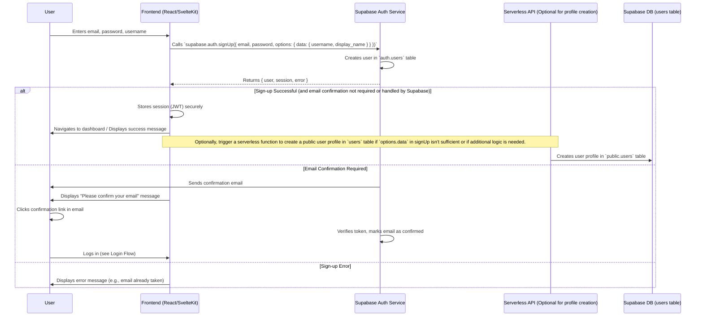
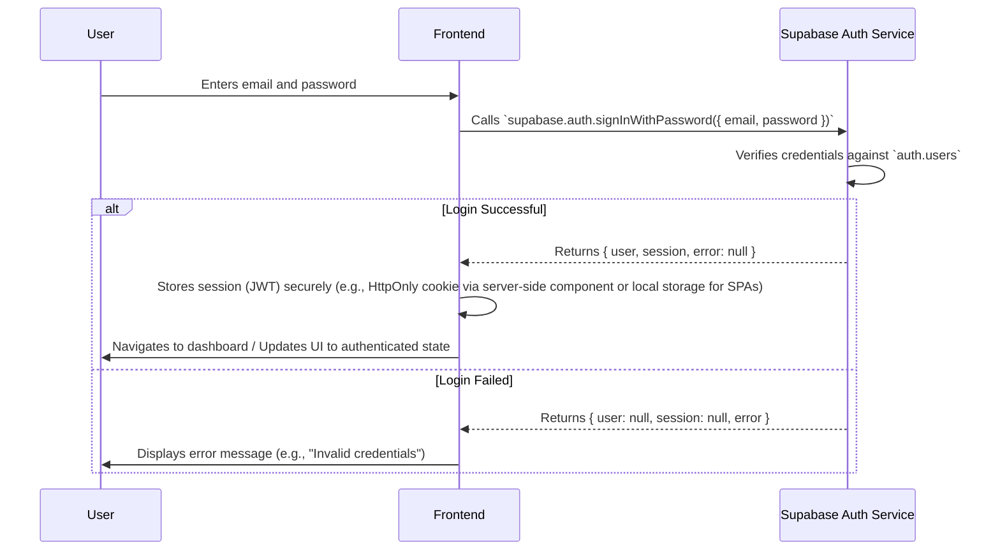
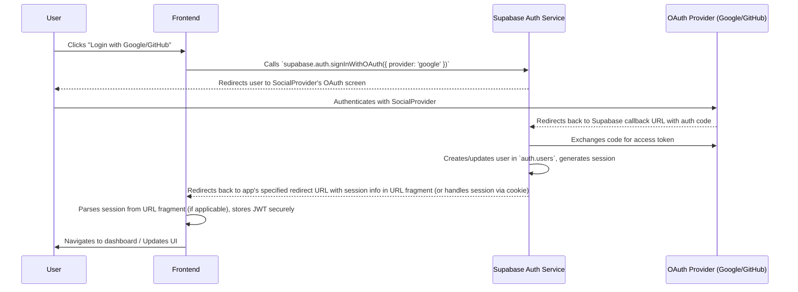
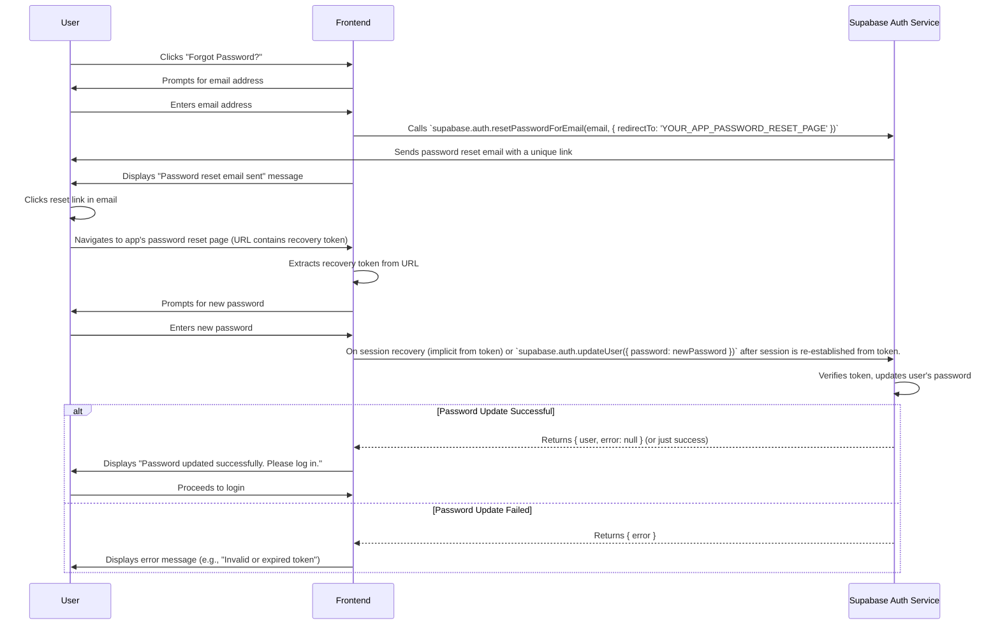
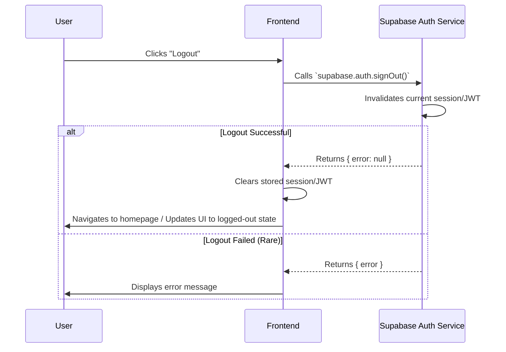

# Authentication Flow for AestheticPalettes

## 1. Introduction

This document details the user authentication flow for AestheticPalettes, as per task T027. The system will leverage Supabase Auth to handle user registration, login, session management, and password recovery, supporting email/password and social logins. This aligns with the zero-cost infrastructure goal and security requirements (FR3.x, NFR3).

## 2. Authentication Provider: Supabase Auth

Supabase Auth is chosen for its generous free tier, ease of integration, built-in support for PostgreSQL Row Level Security (RLS), and features like social logins and JWT-based session management.

## 3. Core Authentication Flows

### 3.1. User Registration (Email/Password)

**Steps:**

1.  **User Input:** User provides email, password, and potentially a username on the frontend registration form.
2.  **Frontend Request:** The frontend calls `supabase.auth.signUp()` with the user's credentials and any additional metadata (like username) to be stored in `auth.users.raw_user_meta_data` or used to populate a public `users` profile table.
3.  **Supabase Processing:** Supabase Auth attempts to create a new user.
    - If successful and email confirmation is enabled (default and recommended), an email is sent to the user.
    - The user is created in the `auth.users` table.
4.  **Response to Frontend:**
    - On success, Supabase returns user and session objects (session might be null until email confirmation).
    - On failure (e.g., email already exists), an error object is returned.
5.  **Email Confirmation (if enabled):**
    - User clicks the link in the confirmation email.
    - Supabase verifies the token and marks the email as confirmed.
6.  **Profile Creation (Post-Confirmation/Sign-up):**
    - A Supabase Function (triggered by `auth.users` insert or called by frontend) can create a corresponding entry in the `public.users` table, populating it with `username`, `display_name`, etc. This keeps `auth.users` private and `public.users` for public profile data.

### 3.2. User Login (Email/Password)

**Steps:**

1.  **User Input:** User provides their email and password on the login form.
2.  **Frontend Request:** The frontend calls `supabase.auth.signInWithPassword()`.
3.  **Supabase Processing:** Supabase Auth validates the credentials.
4.  **Response to Frontend:**
    - On success, returns user and session objects (containing JWT).
    - On failure, returns an error.
5.  **Session Management:** Frontend securely stores the JWT (e.g., in an HttpOnly cookie if using SSR with SvelteKit, or localStorage/sessionStorage for SPAs, though cookies are generally preferred for security if possible) and includes it in the `Authorization` header for subsequent API requests to the GraphQL backend.

### 3.3. Social Logins (e.g., Google, GitHub)

**Steps:**

1.  **User Action:** User clicks a "Sign in with [Provider]" button.
2.  **Frontend Request:** Frontend calls `supabase.auth.signInWithOAuth({ provider: 'google' /* or 'github', etc. */ })`.
3.  **Redirect to Provider:** Supabase redirects the user to the OAuth provider's authentication page.
4.  **Provider Authentication:** User authenticates with the social provider.
5.  **Redirect to Supabase:** Provider redirects back to Supabase's OAuth callback URL.
6.  **Session Creation:** Supabase exchanges the OAuth code for user details, creates or updates the user in `auth.users`, and establishes a session.
7.  **Redirect to App:** Supabase redirects the user back to the application's configured redirect URL. The session (JWT) is often passed in the URL fragment or handled via cookies set by Supabase.
8.  **Frontend Session Handling:** Frontend extracts the session information, stores the JWT securely, and updates the UI.

### 3.4. Password Reset

**Steps (Request Reset):**

1.  User indicates they forgot their password.
2.  Frontend prompts for their email address.
3.  Frontend calls `supabase.auth.resetPasswordForEmail(email, { redirectTo: 'URL_TO_YOUR_APP_RESET_PAGE' })`.
4.  Supabase sends an email to the user with a password reset link.

**Steps (Update Password):**

1.  User clicks the reset link in their email.
2.  They are redirected to the app's password reset page. The URL will contain a recovery token.
3.  Supabase client library automatically handles the recovery token from the URL when the user lands on this page, establishing a temporary session.
4.  Frontend prompts for a new password.
5.  Frontend calls `supabase.auth.updateUser({ password: newPassword })`.
6.  Supabase verifies the token (implicitly via the session) and updates the password.
7.  User is notified of success and typically redirected to the login page.

### 3.5. User Logout

**Steps:**

1.  User clicks the logout button.
2.  Frontend calls `supabase.auth.signOut()`.
3.  Supabase invalidates the user's session.
4.  Frontend clears any stored session data (JWT) and updates the UI.

## 4. Session Management

- **JWTs:** Supabase Auth uses JSON Web Tokens (JWTs) for session management.
- **Storage:**
  - For SPAs (React/Vite): JWTs can be stored in `localStorage` or `sessionStorage`. `localStorage` persists across browser sessions, `sessionStorage` does not.
  - For SSR applications (like SvelteKit): JWTs are best handled via secure, HttpOnly cookies. The Supabase client library has helpers for this (`@supabase/auth-helpers-sveltekit`).
- **Token Refresh:** Supabase client libraries automatically handle JWT refreshing in the background as long as a valid refresh token is available.
- **API Requests:** The JWT must be included in the `Authorization` header (e.g., `Authorization: Bearer YOUR_JWT_TOKEN`) for all requests to protected GraphQL API endpoints.

## 5. Security Considerations (FR3.x, NFR3)

- **HTTPS:** All communication must be over HTTPS.
- **Password Strength:** Encourage strong passwords on the frontend (though Supabase doesn't enforce this by default, custom checks can be added).
- **Email Confirmation:** Strongly recommended to verify user identity.
- **Secure JWT Storage:** Follow best practices for JWT storage (HttpOnly cookies are generally preferred over `localStorage` if feasible to mitigate XSS risks).
- **Rate Limiting:** Supabase provides some level of rate limiting. Additional rate limiting can be implemented on custom API endpoints if needed.
- **CSRF Protection:** If using cookie-based sessions, ensure CSRF protection mechanisms are in place (often handled by frameworks like SvelteKit when using form actions).
- **Input Sanitization:** Always sanitize user inputs on the frontend and backend.

This authentication flow provides a secure and user-friendly experience for AestheticPalettes users, leveraging the robust features of Supabase Auth.
