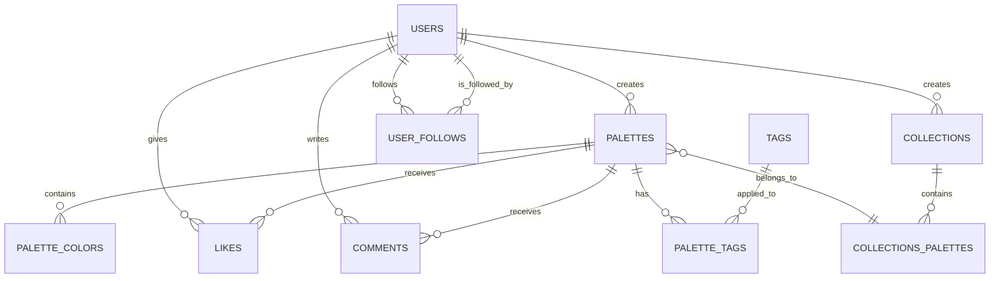

# Database Schema for AestheticPalettes (Supabase/PostgreSQL)

## 1. Introduction

This document outlines the database schema for AestheticPalettes, designed for use with Supabase (PostgreSQL). The schema supports all functional requirements related to user accounts, palette storage, management, and community features, while considering scalability (NFR4.3) and query performance (NFR4.8) within the zero-cost infrastructure. This corresponds to task T025.

## 2. Guiding Principles

- **Relational Model:** Leverage PostgreSQL's relational capabilities for data integrity and structured querying.
- **Normalization:** Apply normalization principles to reduce data redundancy and improve consistency, balanced with performance considerations for common queries.
- **Scalability:** Design schema to handle growth in users and palettes. Use appropriate data types and indexing.
- **Security:** Utilize Supabase's Row Level Security (RLS) for fine-grained access control.
- **Zero-Cost:** Optimize for Supabase's free tier limitations (e.g., storage size, query performance).

## 3. Entity-Relationship Diagram (Conceptual)



```
    USERS {
        UUID id PK "User ID (from Supabase Auth)"
        TEXT username UNIQUE "Unique username"
        TEXT display_name
        TEXT avatar_url
        TEXT bio
        TIMESTAMPTZ created_at
        TIMESTAMPTZ updated_at
    }

    PALETTES {
        UUID id PK "Palette ID"
        UUID user_id FK "Creator User ID"
        TEXT name "Optional name for the palette"
        TEXT description "Optional description"
        BOOLEAN is_public DEFAULT true
        INTEGER like_count DEFAULT 0
        INTEGER comment_count DEFAULT 0
        TIMESTAMPTZ created_at
        TIMESTAMPTZ updated_at
    }

    PALETTE_COLORS {
        UUID id PK "Palette Color ID"
        UUID palette_id FK "Associated Palette ID"
        TEXT hex_code "Hex color code (e.g., #RRGGBB)"
        INTEGER sort_order "Order of the color in the palette"
        TIMESTAMPTZ created_at
    }

    COLLECTIONS {
        UUID id PK "Collection ID"
        UUID user_id FK "Creator User ID"
        TEXT name "Name of the collection"
        TEXT description "Optional description"
        TIMESTAMPTZ created_at
        TIMESTAMPTZ updated_at
    }

    COLLECTIONS_PALETTES {
        UUID collection_id FK "Collection ID"
        UUID palette_id FK "Palette ID"
        TIMESTAMPTZ added_at
        PRIMARY KEY (collection_id, palette_id)
    }

    TAGS {
        UUID id PK "Tag ID"
        TEXT name UNIQUE "Tag name (e.g., 'vibrant', 'pastel')"
        TIMESTAMPTZ created_at
    }

    PALETTE_TAGS {
        UUID palette_id FK "Palette ID"
        UUID tag_id FK "Tag ID"
        TIMESTAMPTZ assigned_at
        PRIMARY KEY (palette_id, tag_id)
    }

    LIKES {
        UUID user_id FK "Liker User ID"
        UUID palette_id FK "Liked Palette ID"
        TIMESTAMPTZ created_at
        PRIMARY KEY (user_id, palette_id)
    }

    COMMENTS {
        UUID id PK "Comment ID"
        UUID user_id FK "Commenter User ID"
        UUID palette_id FK "Commented Palette ID"
        TEXT content "Comment text"
        TIMESTAMPTZ created_at
        TIMESTAMPTZ updated_at
    }

    USER_FOLLOWS {
        UUID follower_id FK "Follower User ID (User A)"
        UUID following_id FK "Followed User ID (User B)"
        TIMESTAMPTZ created_at
        PRIMARY KEY (follower_id, following_id)
    }

```

## 4. Table Definitions

### 4.1. `users` (Public Schema)

This table will store public profile information for users. It complements Supabase's built-in `auth.users` table.

- `id` (UUID, Primary Key): Foreign key to `auth.users.id`.
- `username` (TEXT, Unique, Not Null): User-chosen unique username.
- `display_name` (TEXT): User's display name.
- `avatar_url` (TEXT): URL to the user's avatar image.
- `bio` (TEXT): Short user biography.
- `created_at` (TIMESTAMPTZ, Default: `now()`): Timestamp of profile creation.
- `updated_at` (TIMESTAMPTZ, Default: `now()`): Timestamp of last profile update.

_Indexes: `username` (unique index), `id` (primary key)_

### 4.2. `palettes`

Stores information about each color palette.

- `id` (UUID, Primary Key, Default: `gen_random_uuid()`): Unique identifier for the palette.
- `user_id` (UUID, Foreign Key to `users.id`): The user who created/owns the palette. Can be NULL for anonymous/sample palettes if supported.
- `name` (TEXT): Optional user-defined name for the palette.
- `description` (TEXT): Optional user-defined description for the palette.
- `is_public` (BOOLEAN, Default: `true`): Whether the palette is visible to others.
- `like_count` (INTEGER, Default: 0): Denormalized count of likes for performance.
- `comment_count` (INTEGER, Default: 0): Denormalized count of comments for performance.
- `created_at` (TIMESTAMPTZ, Default: `now()`): Timestamp of palette creation.
- `updated_at` (TIMESTAMPTZ, Default: `now()`): Timestamp of last palette update.

_Indexes: `user_id`, `created_at` (for sorting by new), `like_count` (for trending)_

### 4.3. `palette_colors`

Stores the individual colors within each palette and their order.

- `id` (UUID, Primary Key, Default: `gen_random_uuid()`): Unique identifier for the palette color entry.
- `palette_id` (UUID, Foreign Key to `palettes.id`, Not Null, On Delete Cascade): The palette this color belongs to.
- `hex_code` (TEXT, Not Null): The color value (e.g., "#FF5733"). Store as text; validation at application level.
- `sort_order` (INTEGER, Not Null): Defines the order of the color within the palette (e.g., 0, 1, 2, 3, 4).
- `created_at` (TIMESTAMPTZ, Default: `now()`)

_Indexes: `palette_id`, `(palette_id, sort_order)` (for ordered retrieval)_

_Note: Instead of a separate table, `colors` could be a JSONB array in the `palettes` table (e.g., `[{hex: "#RRGGBB", order: 0}, ...]`). This simplifies queries for a single palette but makes querying across all colors harder. For Coolors-like functionality where palettes are the primary entity, JSONB might be more performant for reads. The separate table approach is more relational and flexible for querying individual colors if needed for advanced analytics or features._ The `documentation.md` example used `JSONB`. Let's align with that for simplicity and performance for palette reads.

**Revised `palettes` table with JSONB for colors:**

- `id` (UUID, Primary Key, Default: `gen_random_uuid()`)
- `user_id` (UUID, Foreign Key to `users.id`)
- `name` (TEXT)
- `description` (TEXT)
- `colors` (JSONB, Not Null): Array of color objects, e.g., `[{"hex": "#RRGGBB", "name": "My Red"}, {"hex": "#00FF00"}]`. Each object can contain hex, and optionally other representations or names.
- `is_public` (BOOLEAN, Default: `true`)
- `like_count` (INTEGER, Default: 0)
- `comment_count` (INTEGER, Default: 0)
- `tags` (TEXT[]): Array of tag strings for simple tagging, or use a many-to-many relationship with a `tags` table for more structured tagging (see below).
- `created_at` (TIMESTAMPTZ, Default: `now()`)
- `updated_at` (TIMESTAMPTZ, Default: `now()`)

_Indexes: `user_id`, `created_at`, `like_count`, GIN index on `colors` (if querying by specific colors), GIN index on `tags`._

### 4.4. `collections`

Allows users to group palettes into collections.

- `id` (UUID, Primary Key, Default: `gen_random_uuid()`)
- `user_id` (UUID, Foreign Key to `users.id`, Not Null): The user who owns the collection.
- `name` (TEXT, Not Null): Name of the collection.
- `description` (TEXT): Optional description.
- `created_at` (TIMESTAMPTZ, Default: `now()`)
- `updated_at` (TIMESTAMPTZ, Default: `now()`)

_Indexes: `user_id`_

### 4.5. `collections_palettes` (Junction Table)

Links palettes to collections (Many-to-Many).

- `collection_id` (UUID, Foreign Key to `collections.id`, On Delete Cascade)
- `palette_id` (UUID, Foreign Key to `palettes.id`, On Delete Cascade)
- `added_at` (TIMESTAMPTZ, Default: `now()`)
- Primary Key: (`collection_id`, `palette_id`)

### 4.6. `tags`

Stores unique tags that can be applied to palettes.

- `id` (UUID, Primary Key, Default: `gen_random_uuid()`)
- `name` (TEXT, Unique, Not Null): The tag string (e.g., "vibrant", "pastel", "dark"). Convert to lowercase for consistency.
- `created_at` (TIMESTAMPTZ, Default: `now()`)

_Indexes: `name` (unique index)_

### 4.7. `palette_tags` (Junction Table)

Links tags to palettes (Many-to-Many). This is an alternative to the `TEXT[]` tags in the `palettes` table if more structured tag management is needed.

- `palette_id` (UUID, Foreign Key to `palettes.id`, On Delete Cascade)
- `tag_id` (UUID, Foreign Key to `tags.id`, On Delete Cascade)
- `assigned_at` (TIMESTAMPTZ, Default: `now()`)
- Primary Key: (`palette_id`, `tag_id`)

_Using `TEXT[]` on `palettes` is simpler for the free tier and might be sufficient initially._

### 4.8. `likes`

Records likes given by users to palettes.

- `user_id` (UUID, Foreign Key to `users.id`, On Delete Cascade)
- `palette_id` (UUID, Foreign Key to `palettes.id`, On Delete Cascade)
- `created_at` (TIMESTAMPTZ, Default: `now()`)
- Primary Key: (`user_id`, `palette_id`)

_Triggers or application logic will update `palettes.like_count`._

### 4.9. `comments`

Stores comments made by users on palettes.

- `id` (UUID, Primary Key, Default: `gen_random_uuid()`)
- `user_id` (UUID, Foreign Key to `users.id`, On Delete Cascade)
- `palette_id` (UUID, Foreign Key to `palettes.id`, On Delete Cascade)
- `content` (TEXT, Not Null): The text of the comment.
- `parent_comment_id` (UUID, Foreign Key to `comments.id`, Nullable): For threaded comments.
- `created_at` (TIMESTAMPTZ, Default: `now()`)
- `updated_at` (TIMESTAMPTZ, Default: `now()`)

_Indexes: `palette_id`, `created_at`._
_Triggers or application logic will update `palettes.comment_count` for top-level comments._

### 4.10. `user_follows`

Stores follow relationships between users.

- `follower_id` (UUID, Foreign Key to `users.id`, On Delete Cascade): The user who is following.
- `following_id` (UUID, Foreign Key to `users.id`, On Delete Cascade): The user who is being followed.
- `created_at` (TIMESTAMPTZ, Default: `now()`)
- Primary Key: (`follower_id`, `following_id`)

_Indexes: `following_id` (to quickly find followers of a user)_

## 5. SQL Definitions (Example for `palettes` with JSONB colors)

```sql
-- Users Table (Public profiles, linked to auth.users)
CREATE TABLE public.users (
  id UUID PRIMARY KEY REFERENCES auth.users(id) ON DELETE CASCADE,
  username TEXT UNIQUE NOT NULL CHECK (char_length(username) >= 3 AND char_length(username) <= 20 AND username ~ '^[a-zA-Z0-9_]+$'),
  display_name TEXT CHECK (char_length(display_name) <= 50),
  avatar_url TEXT CHECK (avatar_url ~ '^https?://.+'),
  bio TEXT CHECK (char_length(bio) <= 160),
  created_at TIMESTAMPTZ DEFAULT now() NOT NULL,
  updated_at TIMESTAMPTZ DEFAULT now() NOT NULL
);
ALTER TABLE public.users ENABLE ROW LEVEL SECURITY;
-- RLS policies for users table (e.g., users can update their own profile)

-- Palettes Table
CREATE TABLE public.palettes (
  id UUID PRIMARY KEY DEFAULT gen_random_uuid(),
  user_id UUID REFERENCES public.users(id) ON DELETE SET NULL, -- Or ON DELETE CASCADE if palettes must have an owner
  name TEXT CHECK (char_length(name) <= 100),
  description TEXT CHECK (char_length(description) <= 500),
  colors JSONB NOT NULL, -- e.g., '[{"hex": "#RRGGBB", "name": "My Red"}, ... ]'
  is_public BOOLEAN DEFAULT true NOT NULL,
  like_count INTEGER DEFAULT 0 NOT NULL CHECK (like_count >= 0),
  comment_count INTEGER DEFAULT 0 NOT NULL CHECK (comment_count >= 0),
  tags TEXT[], -- Simple array of text tags
  created_at TIMESTAMPTZ DEFAULT now() NOT NULL,
  updated_at TIMESTAMPTZ DEFAULT now() NOT NULL
);
ALTER TABLE public.palettes ENABLE ROW LEVEL SECURITY;
-- RLS policies for palettes (e.g., users can manage their own palettes, public can read public palettes)

CREATE INDEX idx_palettes_user_id ON public.palettes(user_id);
CREATE INDEX idx_palettes_created_at ON public.palettes(created_at DESC);
CREATE INDEX idx_palettes_like_count ON public.palettes(like_count DESC);
CREATE INDEX idx_palettes_tags ON public.palettes USING GIN (tags); -- For searching by tags
CREATE INDEX idx_palettes_colors ON public.palettes USING GIN (colors); -- For searching by colors in JSONB

-- Other tables (collections, likes, comments, etc.) would follow a similar pattern.
```

## 6. Data Integrity and Constraints

- Foreign keys are used to maintain relational integrity.
- `NOT NULL` constraints are applied where appropriate.
- `UNIQUE` constraints for fields like `users.username` and `tags.name`.
- `CHECK` constraints for simple validation (e.g., string length, format patterns).
- Application-level validation will handle more complex rules.

## 7. Row Level Security (RLS)

Supabase RLS policies will be crucial:

- Users can only modify their own profiles, palettes, collections.
- Users can only delete their own content.
- Public palettes are readable by anyone; private palettes only by the owner (and collaborators, if that feature is added).
- Likes and comments can be created by authenticated users.

## 8. Scalability and Performance Considerations (NFR4.3, NFR4.8)

- **Indexing:** Appropriate indexes are defined for frequently queried columns and for sorting/filtering (e.g., `user_id`, `created_at`, `like_count`, GIN indexes for JSONB/arrays).
- **Denormalization:** `like_count` and `comment_count` on the `palettes` table are denormalized for faster reads of popular/active palettes. These would be updated using triggers or application logic.
- **JSONB for Colors:** Storing colors as a JSONB array within the `palettes` table can improve read performance for individual palettes, as it avoids joins. GIN indexing on the JSONB field allows for searching within the color data.
- **Connection Pooling:** Supabase handles connection pooling.
- **Query Optimization:** Write efficient SQL queries. Avoid N+1 problems in the application layer.
- **Pagination:** Implement pagination for all list views (e.g., user's palettes, public palettes, comments).

This schema provides a solid foundation for AestheticPalettes, balancing relational structure with performance needs, and is designed to work well within the Supabase ecosystem and its free tier.
