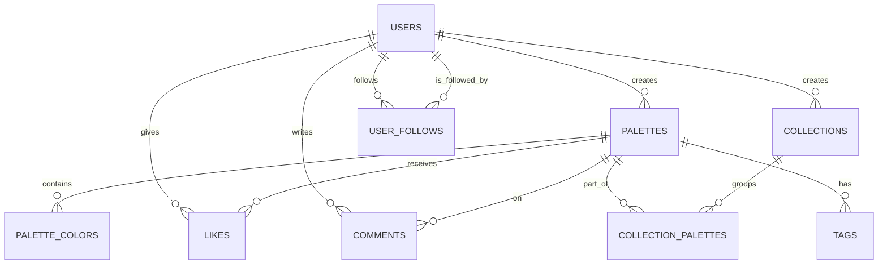

# Database Schema Design: AestheticPalettes

## 1. Introduction

This document outlines the database schema for the AestheticPalettes application, as per task T025. The schema is designed to support all functional requirements related to data storage, including user accounts, palettes, collections, and community interactions, while being compatible with the chosen database technology (Supabase - PostgreSQL) and its free-tier limitations.

## 2. Guiding Principles

- **Normalization:** Aim for a reasonable level of normalization to reduce data redundancy and improve data integrity, while balancing query performance.
- **Scalability:** Design schema to handle growth within free-tier limits and allow for easier scaling if migrating to paid tiers in the future.
- **Performance:** Optimize for common query patterns. Use appropriate indexing.
- **Flexibility:** Allow for future enhancements and feature additions with minimal schema changes.
- **Supabase Compatibility:** Leverage PostgreSQL features available through Supabase.

## 3. Database Technology

- **Selected Database:** PostgreSQL (via Supabase free tier)
- **Rationale:** Relational model provides strong data integrity. Supabase offers a generous free tier with PostgreSQL, built-in authentication, and storage.

## 4. Entity-Relationship Diagram (ERD) - Conceptual



```
    TAGS {
        string name PK
        timestamptz created_at
    }

    PALETTE_TAGS {
        uuid palette_id FK
        string tag_name FK
        PK (palette_id, tag_name)
    }

    PALETTES o|..|| PALETTE_TAGS : has
    TAGS o|..|| PALETTE_TAGS : associated_with

    USERS {
        uuid id PK "Supabase auth.users.id"
        string username UK
        string email UK "Supabase auth.users.email"
        string avatar_url
        string bio
        timestamptz created_at
        timestamptz updated_at
    }

    PALETTES {
        uuid id PK
        uuid user_id FK
        string name
        string description
        boolean is_public DEFAULT true
        timestamptz created_at
        timestamptz updated_at
        integer views_count DEFAULT 0
        integer likes_count DEFAULT 0
    }

    PALETTE_COLORS {
        uuid id PK
        uuid palette_id FK
        string hex_value
        integer sort_order
        string name
    }

    COLLECTIONS {
        uuid id PK
        uuid user_id FK
        string name
        string description
        boolean is_public DEFAULT true
        timestamptz created_at
        timestamptz updated_at
    }

    COLLECTION_PALETTES {
        uuid collection_id FK
        uuid palette_id FK
        timestamptz added_at
        PK (collection_id, palette_id)
    }

    LIKES {
        uuid user_id FK
        uuid palette_id FK
        timestamptz created_at
        PK (user_id, palette_id)
    }

    COMMENTS {
        uuid id PK
        uuid user_id FK
        uuid palette_id FK
        text content
        timestamptz created_at
        timestamptz updated_at
    }

    USER_FOLLOWS {
        uuid follower_id FK "User A"
        uuid following_id FK "User B (A follows B)"
        timestamptz created_at
        PK (follower_id, following_id)
    }
```

## 5. Table Definitions

### 5.1. `users`

- This table will primarily reference `auth.users` table provided by Supabase. We might create a `profiles` table to store additional public user information linked via a one-to-one relationship with `auth.users.id`.

  ```sql
  -- Corresponds to Supabase's auth.users table
  -- We will create a 'profiles' table for public user data
  CREATE TABLE profiles (
    id UUID PRIMARY KEY REFERENCES auth.users(id) ON DELETE CASCADE,
    username TEXT UNIQUE,
    avatar_url TEXT,
    bio TEXT,
    website_url TEXT,
    updated_at TIMESTAMPTZ DEFAULT NOW()
  );
  ```

  - **Indexes:** `profiles(username)`

### 5.2. `palettes`

- Stores information about each color palette.

  ```sql
  CREATE TABLE palettes (
    id UUID PRIMARY KEY DEFAULT uuid_generate_v4(),
    user_id UUID REFERENCES auth.users(id) ON DELETE SET NULL, -- Or CASCADE if palettes should be deleted with user
    name VARCHAR(255) NOT NULL,
    description TEXT,
    colors JSONB NOT NULL, -- Array of color objects e.g. [{"hex": "#RRGGBB", "name": "Red"}, ...]
    is_public BOOLEAN DEFAULT TRUE,
    slug TEXT UNIQUE, -- For SEO-friendly URLs, generated from name
    views_count INTEGER DEFAULT 0,
    likes_count INTEGER DEFAULT 0, -- Denormalized for performance
    created_at TIMESTAMPTZ DEFAULT NOW(),
    updated_at TIMESTAMPTZ DEFAULT NOW()
  );
  ```

  - **Indexes:** `palettes(user_id)`, `palettes(slug)`, `palettes(created_at DESC)`
  - **Note on `colors` JSONB:** Storing colors as a JSONB array is a practical choice for flexibility. Each object in the array could contain `hex`, `rgb`, `hsl`, `name`, etc. This simplifies the schema but makes querying individual colors across palettes harder. An alternative is a separate `palette_colors` table as shown in the ERD, which is better for normalization and querying specific colors but adds complexity.
    - For this project, the `PALETTE_COLORS` table approach from the ERD is preferred for better relational integrity if complex color queries are anticipated.

  ```sql
  -- Preferred structure for colors if more relational querying is needed:
  CREATE TABLE palette_colors (
      id UUID PRIMARY KEY DEFAULT uuid_generate_v4(),
      palette_id UUID REFERENCES palettes(id) ON DELETE CASCADE NOT NULL,
      hex_value CHAR(7) NOT NULL, -- #RRGGBB
      name VARCHAR(100),
      sort_order INTEGER NOT NULL -- To maintain order of colors in palette
  );
  CREATE INDEX idx_palette_colors_palette_id ON palette_colors(palette_id);
  ALTER TABLE palettes DROP COLUMN colors; -- If using this approach
  ```

### 5.3. `collections`

- Allows users to group palettes into collections.

  ```sql
  CREATE TABLE collections (
    id UUID PRIMARY KEY DEFAULT uuid_generate_v4(),
    user_id UUID REFERENCES auth.users(id) ON DELETE CASCADE NOT NULL,
    name VARCHAR(255) NOT NULL,
    description TEXT,
    is_public BOOLEAN DEFAULT TRUE,
    slug TEXT UNIQUE, -- For SEO-friendly URLs
    created_at TIMESTAMPTZ DEFAULT NOW(),
    updated_at TIMESTAMPTZ DEFAULT NOW()
  );
  ```

  - **Indexes:** `collections(user_id)`, `collections(slug)`

### 5.4. `collection_palettes` (Junction Table)

- Links palettes to collections (many-to-many relationship).

  ```sql
  CREATE TABLE collection_palettes (
    collection_id UUID REFERENCES collections(id) ON DELETE CASCADE NOT NULL,
    palette_id UUID REFERENCES palettes(id) ON DELETE CASCADE NOT NULL,
    added_at TIMESTAMPTZ DEFAULT NOW(),
    PRIMARY KEY (collection_id, palette_id)
  );
  ```

### 5.5. `tags`

- Stores unique tags that can be applied to palettes.

  ```sql
  CREATE TABLE tags (
    id UUID PRIMARY KEY DEFAULT uuid_generate_v4(),
    name VARCHAR(50) UNIQUE NOT NULL,
    created_at TIMESTAMPTZ DEFAULT NOW()
  );
  ```

  - **Indexes:** `tags(name)`

### 5.6. `palette_tags` (Junction Table)

- Links palettes to tags (many-to-many relationship).

  ```sql
  CREATE TABLE palette_tags (
    palette_id UUID REFERENCES palettes(id) ON DELETE CASCADE NOT NULL,
    tag_id UUID REFERENCES tags(id) ON DELETE CASCADE NOT NULL,
    PRIMARY KEY (palette_id, tag_id)
  );
  ```

### 5.7. `likes`

- Tracks user likes on palettes.

  ```sql
  CREATE TABLE likes (
    user_id UUID REFERENCES auth.users(id) ON DELETE CASCADE NOT NULL,
    palette_id UUID REFERENCES palettes(id) ON DELETE CASCADE NOT NULL,
    created_at TIMESTAMPTZ DEFAULT NOW(),
    PRIMARY KEY (user_id, palette_id)
  );
  ```

  - **Note:** `palettes.likes_count` can be updated using triggers or application logic for denormalization.

### 5.8. `comments`

- Stores user comments on palettes.

  ```sql
  CREATE TABLE comments (
    id UUID PRIMARY KEY DEFAULT uuid_generate_v4(),
    user_id UUID REFERENCES auth.users(id) ON DELETE CASCADE NOT NULL,
    palette_id UUID REFERENCES palettes(id) ON DELETE CASCADE NOT NULL,
    parent_comment_id UUID REFERENCES comments(id) ON DELETE CASCADE, -- For threaded comments
    content TEXT NOT NULL,
    created_at TIMESTAMPTZ DEFAULT NOW(),
    updated_at TIMESTAMPTZ DEFAULT NOW()
  );
  ```

  - **Indexes:** `comments(palette_id, created_at DESC)`

### 5.9. `user_follows`

- Tracks follow relationships between users.

  ```sql
  CREATE TABLE user_follows (
    follower_id UUID REFERENCES auth.users(id) ON DELETE CASCADE NOT NULL, -- The user who is following
    following_id UUID REFERENCES auth.users(id) ON DELETE CASCADE NOT NULL, -- The user being followed
    created_at TIMESTAMPTZ DEFAULT NOW(),
    PRIMARY KEY (follower_id, following_id)
  );
  ```

  - **Indexes:** `user_follows(following_id)`

## 6. Data Integrity

- **Foreign Keys:** Used extensively to maintain referential integrity.
- **Constraints:** `NOT NULL`, `UNIQUE` constraints applied where appropriate.
- **Cascading Deletes:** Implemented where logical (e.g., deleting a user might cascade to delete their collections, or set `user_id` to NULL on palettes if they are to be kept anonymously).

## 7. Indexing Strategy

- Primary keys are automatically indexed.
- Foreign keys are generally good candidates for indexing.
- Indexes are added to columns frequently used in `WHERE` clauses, `JOIN` conditions, and `ORDER BY` clauses (e.g., `slugs`, `created_at` for sorting recent items).

## 8. Future Considerations

- **Full-Text Search:** For searching palettes by name/description or tags, PostgreSQL's full-text search capabilities can be leveraged.
- **Denormalization:** `likes_count` in `palettes` is an example. More denormalization might be needed for performance on read-heavy operations, balanced against write complexity.
- **Analytics Data:** Separate tables or a different system might be used for detailed analytics if Supabase's free tier proves insufficient for complex analytical queries.

This schema provides a solid foundation for AestheticPalettes. It will be created and managed using Supabase's dashboard and migration tools.
