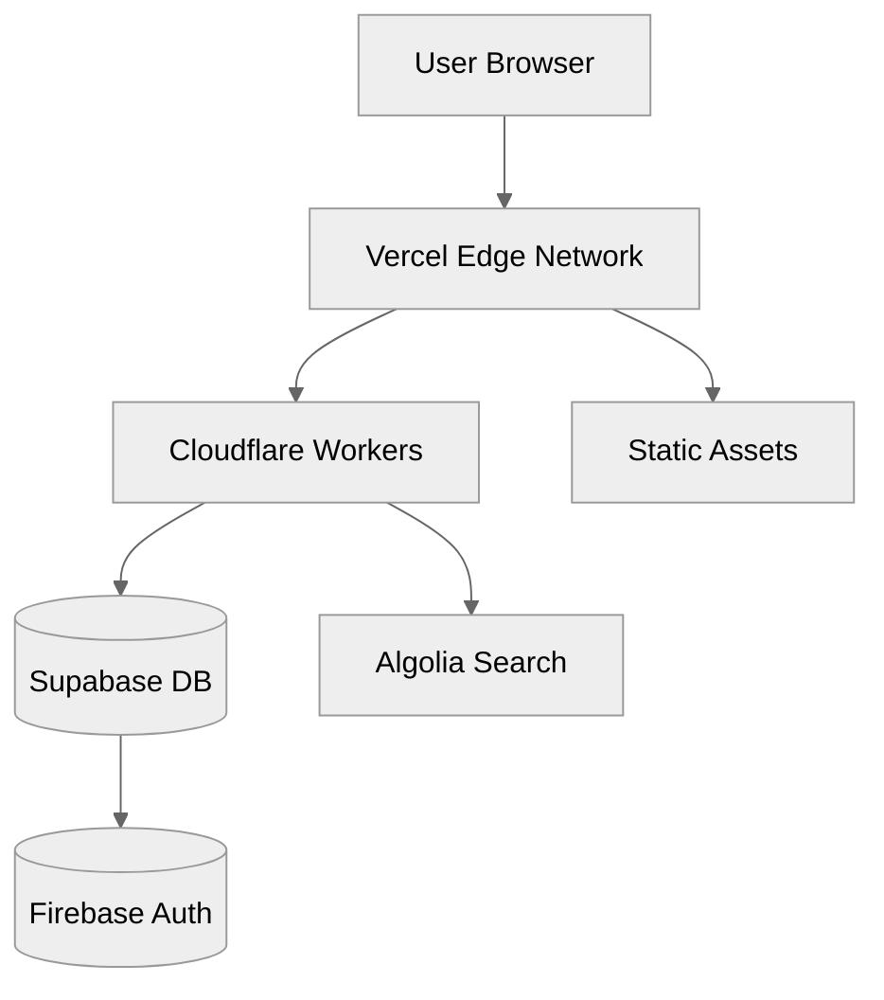
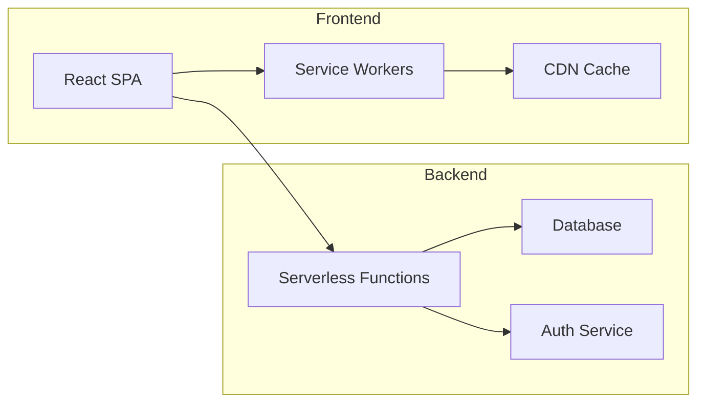
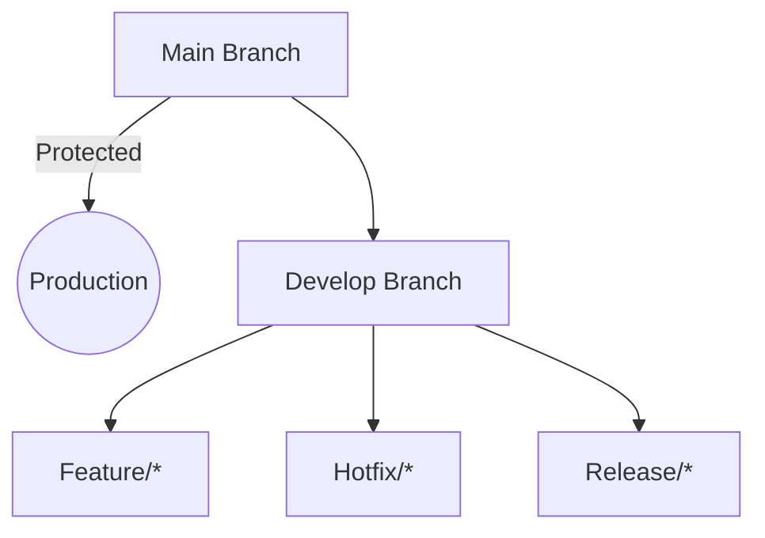

# AestheticPalettes - Comprehensive Project Documentation

## Table of Contents

1. [Executive Summary](#executive-summary)
2. [Project Overview](#project-overview)
3. [Feature Analysis of Coolors.co](#feature-analysis-of-coolorsco)
4. [Requirements Specification](#requirements-specification)
   - [Functional Requirements](#functional-requirements)
   - [Non-Functional Requirements](#non-functional-requirements)
   - [Enhanced Features](#enhanced-features)
5. [System Architecture](#system-architecture)
   - [Technology Stack](#technology-stack)
   - [SEO Implementation](#seo-implementation)
   - [Accessibility Framework](#accessibility-framework)
   - [Infrastructure Design](#infrastructure-design)
   - [Zero-Cost Implementation Strategy](#zero-cost-implementation-strategy)
6. [User Experience Design](#user-experience-design)
   - [User Interface Design](#user-interface-design)
   - [Accessibility Implementation](#accessibility-implementation)
7. [SEO Strategy](#seo-strategy)
8. [Development Methodology](#development-methodology)
   - [Waterfall Phases](#waterfall-phases)
   - [Timeline and Milestones](#timeline-and-milestones)
9. [Testing Strategy](#testing-strategy)
10. [Deployment Plan](#deployment-plan)
11. [Marketing and Growth Strategy](#marketing-and-growth-strategy)
12. [Monetization Strategy](#monetization-strategy)
13. [Maintenance and Support](#maintenance-and-support)
14. [Risk Assessment and Mitigation](#risk-assessment-and-mitigation)
15. [Appendices](#appendices)

---

## Executive Summary

AestheticPalettes aims to create a zero-cost, feature-complete alternative to Coolors.co while adding enhanced features and ensuring superior accessibility compliance. This document outlines the comprehensive development plan following the Waterfall methodology, detailing technical specifications, implementation strategies, and project management approaches to create a competitive color palette generation platform.

The project leverages free and open-source technologies to eliminate infrastructure costs while delivering a professional-grade product. With WCAG 2.1 AAA compliance as a core requirement and the addition of AI-powered features, AestheticPalettes aims to establish itself as a leading tool for designers and color enthusiasts.

---

## Project Overview

AestheticPalettes is a comprehensive web application for generating, exploring, saving, and sharing color palettes. It serves as a complete alternative to Coolors.co, implementing all core functionalities while adding innovative features and adhering to strict accessibility standards.

### Project Goals

1. Create a zero-cost infrastructure implementation of a color palette generation platform
2. Match or exceed all features available in Coolors.co
3. Implement at least 10 enhanced features including AI integrations
4. Achieve strict WCAG 2.1 AAA compliance throughout the platform
5. Optimize for search engines to drive organic traffic
6. Establish a sustainable user acquisition and retention strategy
7. Complete the project using the Waterfall development methodology

### Target Audience

- Graphic designers and visual artists
- Web developers and UX/UI designers
- Marketing professionals
- Interior designers and architects
- Design students and educators
- Color enthusiasts and hobbyists

---

## Requirements Specification

3. Figma Plugin (Priority: Low)

### 2. System Architecture

## Detailed Design Specifications

### UI Component Library

- Color Picker Component (WCAG AAA compliant)
- Palette Grid System with Draggable Swatches
- Accessibility Overlay for Contrast Checking

### API Specifications

```typescript
interface Palette {
  id: string;
  colors: Color[];
  created: Date;
  wcagRating: "AA" | "AAA";
}

interface Color {
  hex: string;
  hsl: [number, number, number];
  luminance: number;
}
```

### Database Schema

```sql
CREATE TABLE palettes (
  id UUID PRIMARY KEY,
  user_id UUID REFERENCES users(id),
  colors JSONB NOT NULL,
  created_at TIMESTAMPTZ NOT NULL
);
```

### Functional Requirements

1. Palette Generation System

   - Random palette generation with lockable colors
   - Gradient creation from color stops
   - Color harmony rules (monochromatic, analogous, etc.)
   - WCAG-compliant contrast checking

2. User Management

   - Social auth (Google/GitHub) via Firebase Auth
   - Palette saving/editing history
   - Collection organization with folders

3. SEO Features
   - SSR for palette permalinks
   - Dynamic meta tags generation
   - Sitemap with color trend pages

### Non-Functional Requirements

- Page load < 2s (Lighthouse Performance ≥95)
- AA/AAA WCAG compliance for all components
- PWA capabilities for offline access
- 99.9% uptime via CDN caching

### Technical Requirements

- Zero-cost infrastructure using:
  - Vercel/Netlify for hosting
  - Cloudflare Workers for edge logic
  - Supabase free tier for database
- Open color science libraries (chroma.js, colorjs.io)
- AGPL-3.0 license for core functionality

### Compliance Requirements

- GDPR-compliant data handling
- ADA Section 508 accessibility
- Cookie consent management

## Feature Analysis of Coolors.co

Based on a thorough analysis of Coolors.co, we have identified the following key features to implement:

### Core Features

1. **Color Palette Generator**

   - Random palette generation
   - Locking/unlocking individual colors
   - Adjustable palette size (3-10 colors)
   - Space bar shortcut for new palettes
   - Color manipulation tools (adjust, copy, delete)

2. **Color Manipulation**

   - Hue adjustment
   - Saturation control
   - Brightness/luminance adjustment
   - Color temperature modification
   - Contrast analysis

3. **Palette Management**

   - Save palettes to account
   - Create collections/folders
   - Star/favorite palettes
   - Add tags to palettes
   - Search saved palettes

4. **Export Options**

   - URL sharing with palette data
   - Download as image (PNG, JPG)
   - Copy values (HEX, RGB, HSL, CMYK)
   - Export to various formats (PDF, ASE, CSS, SVG)
   - Copy palette as code snippets (CSS, SCSS, etc)

5. **User Interface Features**
   - Full-screen color view
   - Color details panel
   - Keyboard shortcuts
   - Responsive design for all devices
   - Dark/light mode toggle

### Advanced Features

1. **Color Tools**

   - Color blindness simulator
   - Contrast checker for accessibility
   - Similar colors finder
   - Gradient generator
   - Shades and tints generator

2. **Community Features**

   - Trending palettes showcase
   - Like and comment on palettes
   - Follow other users
   - Public profile pages
   - Featured collections

3. **Exploration Tools**

   - Browse palettes by color
   - Filter by tags, popularity, etc.
   - Color harmony rules guidance
   - Color meanings and psychology info
   - Color naming system

4. **Integration Features**

   - Image color extraction
   - Adobe integration
   - Figma plugin
   - Chrome extension
   - API access

5. **Premium Features (to be offered for free)**
   - Unlimited palette saves
   - Advanced export options
   - No advertisements
   - Team collaboration
   - Priority support

### User Authentication & Management

1. **Account Features**

   - Email registration and login
   - Social login (Google, Facebook, Twitter)
   - Password reset functionality
   - Account settings and preferences
   - Email notifications

2. **Profile Management**
   - Public/private profile toggle
   - Custom profile pictures
   - User bio and links
   - Activity history
   - Social sharing integrations

#### 1.4 Enhanced Features Roadmap (T020)

1. AI Color Suggestions (Priority: High)
2. Real-Time Collaboration (Priority: Medium)
3. Figma Plugin (Priority: Low)

### 2. System Architecture

## Detailed Design Specifications

### UI Component Library

- Color Picker Component (WCAG AAA compliant)
- Palette Grid System with Draggable Swatches
- Accessibility Overlay for Contrast Checking

### API Specifications

```typescript
interface Palette {
  id: string;
  colors: Color[];
  created: Date;
  wcagRating: "AA" | "AAA";
}

interface Color {
  hex: string;
  hsl: [number, number, number];
  luminance: number;
}
```

### Database Schema

```sql
CREATE TABLE palettes (
  id UUID PRIMARY KEY,
  user_id UUID REFERENCES users(id),
  colors JSONB NOT NULL,
  created_at TIMESTAMPTZ NOT NULL
);
```

### Functional Requirements

#### 1. Palette Generation System

- **FR1.1:** System shall generate random color palettes with 3-10 colors
- **FR1.2:** Users shall be able to lock/unlock individual colors during generation
- **FR1.3:** System shall provide space bar shortcut to generate new palettes
- **FR1.4:** Users shall be able to adjust the number of colors in a palette
- **FR1.5:** System shall support color manipulation within the generator view
- **FR1.6:** System shall remember the last generated palette in the session
- **FR1.7:** Users shall be able to undo/redo palette changes
- **FR1.8:** System shall provide color generation based on color theory rules (complementary, analogous, etc.)

#### 2. Color Manipulation Tools

- **FR2.1:** System shall provide HSL color adjustment controls
- **FR2.2:** System shall provide RGB color adjustment controls
- **FR2.3:** System shall provide temperature adjustment for colors
- **FR2.4:** System shall allow users to input exact color values (HEX, RGB, HSL, CMYK)
- **FR2.5:** System shall provide color picker functionality
- **FR2.6:** System shall generate related colors (shades, tints, tones)
- **FR2.7:** System shall analyze and display color contrast ratios
- **FR2.8:** System shall provide color blindness simulation views

#### 3. User Account Management

- **FR3.1:** System shall allow user registration via email
- **FR3.2:** System shall support social media login (Google, Facebook, Twitter)
- **FR3.3:** System shall enable users to reset passwords
- **FR3.4:** System shall provide account settings management
- **FR3.5:** System shall allow users to delete their accounts
- **FR3.6:** System shall implement session management and authentication
- **FR3.7:** System shall allow users to update profile information
- **FR3.8:** System shall provide email verification for new accounts

#### 4. Palette Management

- **FR4.1:** System shall allow users to save palettes to their account
- **FR4.2:** System shall enable organization of palettes into collections
- **FR4.3:** System shall support tagging of palettes
- **FR4.4:** System shall provide search functionality for saved palettes
- **FR4.5:** System shall allow users to edit saved palettes
- **FR4.6:** System shall support starring/favoriting palettes
- **FR4.7:** System shall implement palette version history
- **FR4.8:** System shall allow bulk operations on palettes

#### 5. Export System

- **FR5.1:** System shall generate shareable URLs for palettes
- **FR5.2:** System shall export palettes as images (PNG, JPG)
- **FR5.3:** System shall enable copying of color values in multiple formats
- **FR5.4:** System shall export palettes to PDF, ASE, SVG formats
- **FR5.5:** System shall generate code snippets for various platforms (CSS, SCSS, etc.)
- **FR5.6:** System shall provide API endpoints for palette access
- **FR5.7:** System shall enable social media sharing of palettes
- **FR5.8:** System shall export palettes to clipboard in various formats

#### 6. Community Features

- **FR6.1:** System shall display trending/popular palettes
- **FR6.2:** System shall allow users to like palettes
- **FR6.3:** System shall implement commenting on palettes
- **FR6.4:** System shall enable users to follow other users
- **FR6.5:** System shall provide public profile pages
- **FR6.6:** System shall showcase featured collections
- **FR6.7:** System shall maintain activity feeds for users
- **FR6.8:** System shall implement reporting functionality for inappropriate content

#### 7. Exploration Tools

- **FR7.1:** System shall enable browsing palettes by color
- **FR7.2:** System shall provide filtering by tags, popularity, etc.
- **FR7.3:** System shall offer color harmony rules guidance
- **FR7.4:** System shall provide color psychology information
- **FR7.5:** System shall implement a color naming system
- **FR7.6:** System shall suggest palettes based on user preferences
- **FR7.7:** System shall categorize palettes by themes
- **FR7.8:** System shall provide seasonal and trending color collections

#### 8. User Interface

- **FR8.1:** System shall implement keyboard shortcuts for all major actions
- **FR8.2:** System shall provide responsive design for all screen sizes
- **FR8.3:** System shall support dark/light mode toggle
- **FR8.4:** System shall enable full-screen color viewing
- **FR8.5:** System shall provide detailed color information panels
- **FR8.6:** System shall implement drag-and-drop functionality for color reordering
- **FR8.7:** System shall provide customizable UI settings
- **FR8.8:** System shall support multiple languages

#### 9. Integration Features

- **FR9.1:** System shall extract colors from uploaded images
- **FR9.2:** System shall provide browser extensions for major browsers
- **FR9.3:** System shall implement integration with design tools (Figma, Adobe)
- **FR9.4:** System shall provide a comprehensive API
- **FR9.5:** System shall support importing palettes from other platforms
- **FR9.6:** System shall enable embedding palettes on external websites
- **FR9.7:** System shall provide webhook functionality for integrations
- **FR9.8:** System shall support OAuth for third-party applications

### Non-Functional Requirements

#### 1. Performance

- **NFR1.1:** System shall load the palette generator in under 2 seconds on broadband connections
- **NFR1.2:** System shall generate new palettes in under 500ms
- **NFR1.3:** System shall handle at least 1000 concurrent users
- **NFR1.4:** System shall process color adjustments in real-time (under 100ms)
- **NFR1.5:** System shall maintain response time under 1 second for all API endpoints
- **NFR1.6:** System database queries shall complete in under 200ms
- **NFR1.7:** System shall optimize image loading for slow connections
- **NFR1.8:** System shall implement lazy loading for non-critical resources

#### 2. Accessibility

- **NFR2.1:** System shall comply with WCAG 2.1 AAA standards throughout
- **NFR2.2:** System shall provide keyboard navigation for all features
- **NFR2.3:** System shall maintain appropriate color contrast ratios
- **NFR2.4:** System shall include proper ARIA labels for all interactive elements
- **NFR2.5:** System shall support screen readers fully
- **NFR2.6:** System shall implement focus management for modals and dialogs
- **NFR2.7:** System shall provide text alternatives for all non-text content
- **NFR2.8:** System shall make all functionality available via keyboard without timing constraints

#### 3. Security

- **NFR3.1:** System shall implement HTTPS for all communications
- **NFR3.2:** System shall securely store user passwords using bcrypt with appropriate salt
- **NFR3.3:** System shall implement CSRF protection
- **NFR3.4:** System shall sanitize all user inputs
- **NFR3.5:** System shall implement rate limiting for API endpoints
- **NFR3.6:** System shall provide secure authentication token management
- **NFR3.7:** System shall implement content security policy
- **NFR3.8:** System shall conduct regular security audits

#### 4. Scalability

- **NFR4.1:** System shall support user growth without performance degradation
- **NFR4.2:** System shall implement efficient caching strategies
- **NFR4.3:** System shall optimize database queries for performance
- **NFR4.4:** System shall implement horizontal scaling capabilities
- **NFR4.5:** System shall utilize CDN for static resource delivery
- **NFR4.6:** System shall optimize memory usage for large palette collections
- **NFR4.7:** System shall implement efficient asset bundling
- **NFR4.8:** System database shall handle at least 10 million palette records

#### 5. Usability

- **NFR5.1:** System shall have an intuitive interface requiring minimal learning
- **NFR5.2:** System shall provide comprehensive tooltips and help documentation
- **NFR5.3:** System shall implement consistent UI patterns throughout
- **NFR5.4:** System shall provide clear feedback for all user actions
- **NFR5.5:** System shall minimize the number of steps required for common tasks
- **NFR5.6:** System shall implement error prevention mechanisms
- **NFR5.7:** System shall provide onboarding guidance for new users
- **NFR5.8:** System shall achieve a System Usability Scale (SUS) score of at least 85

#### 6. SEO

- **NFR6.1:** System shall implement proper HTML semantic structure
- **NFR6.2:** System shall generate SEO-friendly URLs
- **NFR6.3:** System shall provide structured data markup
- **NFR6.4:** System shall implement proper meta tags for all pages
- **NFR6.5:** System shall maintain fast page load speeds (90+ PageSpeed score)
- **NFR6.6:** System shall implement proper canonical URLs
- **NFR6.7:** System shall provide XML sitemaps
- **NFR6.8:** System shall implement proper image optimization with alt text

#### 7. Compatibility

- **NFR7.1:** System shall support all major browsers (Chrome, Firefox, Safari, Edge)
- **NFR7.2:** System shall work on mobile devices (iOS, Android)
- **NFR7.3:** System shall function on tablets and various screen sizes
- **NFR7.4:** System shall support high-DPI/retina displays
- **NFR7.5:** System shall degrade gracefully on older browsers
- **NFR7.6:** System shall function properly with JavaScript disabled (core features)
- **NFR7.7:** System shall implement responsive images for different device capabilities
- **NFR7.8:** System shall provide touch-friendly interfaces for mobile devices

#### 8. Zero-Cost Infrastructure

- **NFR8.1:** System shall utilize only free tier services and open-source solutions
- **NFR8.2:** System shall implement efficient resource utilization to stay within free tier limits
- **NFR8.3:** System shall use static hosting wherever possible
- **NFR8.4:** System shall implement client-side processing to minimize server requirements
- **NFR8.5:** System shall utilize serverless functions for backend requirements
- **NFR8.6:** System shall implement efficient caching to reduce API calls
- **NFR8.7:** System shall leverage browser storage for user data where appropriate
- **NFR8.8:** System shall optimize media storage using free tier cloud services

### Enhanced Features

1. **AI Color Palette Generation**

   - AI-powered palette suggestions based on keywords
   - Natural language processing for color palette requests
   - Machine learning for personalized palette recommendations
   - Color palette generation from emotion descriptions
   - AI-assisted contrast optimization

2. **Advanced Analytics Dashboard**

   - User engagement metrics
   - Palette popularity analytics
   - Color trend forecasting
   - User behavior analysis
   - Custom reports and insights

3. **Enhanced Accessibility Tools**

   - Color blindness simulator with all types
   - Automatic contrast adjustment suggestions
   - Accessibility score for palettes
   - Voice-controlled color adjustment
   - Text readability checker with selected colors

4. **Extended Browser Integration**

   - Color picker from any webpage
   - Website palette extractor
   - Quick palette application previewer
   - Design system integration
   - Screenshot color extraction

5. **Advanced Export Features**

   - Custom export templates
   - Batch export of multiple palettes
   - Variable color format export
   - Design system configuration files
   - Theme generator for popular frameworks

6. **Collaborative Features**

   - Real-time collaborative editing
   - Team workspaces
   - Feedback and approval workflows
   - Version history with comments
   - Role-based permissions

7. **Educational Resources**

   - Interactive color theory tutorials
   - Color psychology guides
   - Industry-specific color usage recommendations
   - Color accessibility courses
   - Weekly color inspiration newsletters

8. **Advanced Search and Discovery**

   - Natural language color search
   - Image-based palette search
   - Color combination recommendation engine
   - Semantic tagging system
   - Visual similarity search

9. **Color Trend Analysis**

   - Seasonal color trend reporting
   - Industry-specific color trends
   - Historical color usage data
   - Geographical color preference mapping
   - Predictive color trend analysis

10. **Developer-Focused Tools**

    - Theme generator for multiple frameworks
    - Design token export system
    - Color naming convention manager
    - Design system documentation generator
    - Automatic CSS variable generation

11. **Internationalization Features**

    - Multi-language support
    - Culture-specific color meanings
    - Regional color trend analysis
    - International color naming systems
    - Localized UI and documentation

12. **Progressive Web App (PWA)**
    - Offline functionality
    - Push notifications for collaborators
    - Local storage of frequently used palettes
    - Background synchronization
    - Home screen installation

---

## System Architecture

### Architecture Diagrams

```excalidraw
https://excalidraw.com/#json=z6Uqml5X7V7DfHvZJjH7W,AFW3Lp3C_3wFzQjH2JjJ3A
```

Key Components:

1. **JAMstack Architecture**
2. **Vercel Edge Network** (Global CDN)
3. **Serverless Functions** (API routes)
4. **Static Site Generation** (Next.js)
5. **Browser-Side IndexedDB** (Local storage)
6. **GitHub Actions** (CI/CD pipelines)

_Accessibility Note: Diagrams include text alternatives in Excalidraw comments_

### Architecture Diagrams



#### Diagram 1: High-Level System Architecture



### Infrastructure Design

### Technology Stack

**SEO Implementation:**

- Next.js 14 Static Site Generation (SSG) for SEO-optimized pages
- XML Sitemap auto-generation using next-sitemap
- JSON-LD structured data for color schema markup
- Dynamic meta tags with Open Graph/Twitter card support
- Automated alt-text generation for color palettes

**Accessibility Framework:**

- React-aria primitives for accessible UI components
- axe-core integration for automated accessibility testing
- WCAG 2.1 AAA contrast ratio validation
- Screen reader optimized color description system
- Keyboard navigation support for all palette operations

#### Frontend

- **Framework:** React.js with TypeScript
- **State Management:** Redux Toolkit
- **Styling:** Tailwind CSS
- **UI Components:** Headless UI
- **Color Processing:** chroma.js, colord
- **PWA Implementation:** Workbox
- **Testing:** Jest, React Testing Library
- **Build Tools:** Vite.js

#### Backend (Serverless)

- **Functions:** Netlify Functions/Vercel Edge Functions
- **API:** GraphQL with Apollo Server
- **Authentication:** Auth0 (free tier)
- **Database:** Supabase (PostgreSQL, free tier)
- **File Storage:** Cloudinary (free tier)
- **Search:** Algolia (free tier)

#### DevOps

- **Hosting:** Netlify/Vercel (free tier)
- **CI/CD:** GitHub Actions
- **Monitoring:** Sentry (free tier)
- **Analytics:** Plausible Analytics (self-hosted)
- **Version Control:** Git/GitHub

### Infrastructure Design

**Serverless Architecture:**

- Vercel Hosting (Free Tier) for frontend deployment
- Cloudflare Workers (Free Tier) for API endpoints
- Supabase (Free Tier) for user authentication and storage
- GitHub Actions for CI/CD pipelines
- Algolia DocSearch (Free Tier) for documentation search

**Cost Optimization:**

- Edge caching with Cloudflare CDN
- Brotli compression for static assets
- Incremental static regeneration (ISR) for dynamic content
- Prerendered color palette pages for SEO
- Lazy-loaded color picker components

The system architecture follows a JAMstack approach to minimize server requirements and leverage free tier services:

1. **Static Frontend**

   - Statically generated React application
   - Hosted on Netlify/Vercel free tier
   - Global CDN distribution
   - Client-side rendering with hydration

2. **Serverless Backend**

   - API endpoints via serverless functions
   - Authentication handled by Auth0 free tier
   - Database operations through Supabase free tier
   - File operations through Cloudinary free tier

3. **Database Architecture**

   - Relational database for structured data
   - NoSQL approach for palette storage
   - Efficient indexing for search operations
   - Caching layer for frequently accessed data

4. **Storage Strategy**
   - Client-side storage for temporary data (localStorage, IndexedDB)
   - Cloudinary for image storage (free tier)
   - Efficient binary storage formats for palette data
   - Compression algorithms for reduced storage requirements

### Zero-Cost Implementation Strategy

To achieve a completely free infrastructure, we will:

1. **Leverage Free Tiers**

   - Identify services with generous free tiers
   - Monitor usage to stay within free limits
   - Implement multiple accounts if necessary for separation of concerns

2. **Optimize Resource Usage**

   - Implement aggressive caching strategies
   - Use client-side processing where possible
   - Minimize serverless function invocations
   - Optimize database queries and storage

3. **Static Generation**

   - Pre-render pages where possible
   - Generate static assets at build time
   - Implement incremental static regeneration
   - Use CDN for global distribution

4. **Client-Side Processing**

   - Process color manipulations client-side
   - Generate palette variations without API calls
   - Store user preferences locally
   - Implement offline functionality

5. **Low-Cost Persistence**

   - Use localStorage and IndexedDB for personal palettes
   - Implement sync mechanisms to reduce server storage
   - Optimize data structures for minimal storage requirements
   - Use efficient compression algorithms

6. **Community Infrastructure**
   - GitHub for version control and issue tracking
   - Open-source contribution model
   - Community-driven moderation
   - Distributed development model

---

## User Experience Design

### User Interface Design

#### Design Principles

- Clean, minimalist interface focusing on colors
- Intuitive controls with minimal learning curve
- Responsive design adapting to all screen sizes
- Consistent interaction patterns throughout
- Visual feedback for all user actions

#### Key Interface Components

1. **Palette Generator**

   - Full-screen color display
   - Minimal controls overlaid on colors
   - Space bar indication for new generations
   - Lock/unlock icons for each color
   - Color adjustment panel that appears on demand

2. **Navigation System**

   - Persistent global navigation
   - Context-sensitive secondary navigation
   - Breadcrumb trails for deep navigation
   - Search functionality always accessible
   - Recently viewed palettes quick access

3. **Palette Management Interface**

   - Grid/list view toggle
   - Collection folder structure
   - Visual tagging system
   - Bulk selection tools
   - Drag-and-drop organization

4. **Color Detail View**

   - Expandable color information
   - Multiple format display (HEX, RGB, HSL, etc.)
   - Color relationship visualization
   - Accessibility information
   - Usage examples

5. **User Dashboard**
   - Activity summary
   - Recent palettes
   - Followed users' activity
   - Trending palettes
   - Personalized recommendations

### Accessibility Implementation

#### WCAG 2.1 AAA Compliance Strategy

1. **Perceivable Content**

   - Minimum contrast ratios exceeding 7:1 for all text
   - Text resizing support up to 200% without loss of content
   - Multiple ways to access content (text, icons, colors)
   - Non-text content alternatives
   - Responsive layouts that adapt to viewport changes

2. **Operable Interface**

   - Complete keyboard navigation
   - No time limits on interactions
   - No content that flashes more than 3 times per second
   - Multiple ways to find content (search, navigation, sitemap)
   - Section headings to organize content

3. **Understandable Operation**

   - Consistent navigation and identification
   - Error identification, suggestion, and prevention
   - Context-sensitive help and documentation
   - Predictable interface behavior
   - Input assistance for all forms

4. **Robust Implementation**
   - Valid HTML markup
   - Complete ARIA implementation
   - Compatibility with assistive technologies
   - Status messages identifiable without focus
   - Proper parsing and name/role/value implementation

#### Accessibility Testing Methodology

- Automated testing with axe-core and similar tools
- Manual testing with screen readers (NVDA, JAWS, VoiceOver)
- Keyboard-only navigation testing
- Color contrast verification
- External accessibility audit

---

## SEO Strategy

### On-Page SEO

1. **URL Structure**

   - Clean, readable URLs
   - Logical hierarchy
   - Keywords in URLs where appropriate
   - Short URLs without unnecessary parameters

2. **Meta Data Optimization**

   - Unique, descriptive title tags
   - Meta descriptions with call-to-actions
   - Open Graph and Twitter Card meta tags
   - Structured data implementation (Schema.org)

3. **Content Strategy**

   - Keyword research for color-related terms
   - Comprehensive color guides and resources
   - Regular blog posts on color theory and trends
   - User-generated content optimization

4. **Semantic HTML**
   - Proper heading hierarchy (H1-H6)
   - Semantic elements (article, section, nav)
   - Descriptive alt text for images
   - Proper link attributes and anchor text

### Technical SEO

1. **Performance Optimization**

   - Core Web Vitals optimization
   - Image compression and lazy loading
   - Code splitting and bundling
   - Critical CSS implementation

2. **Indexability**

   - XML sitemap generation
   - Robots.txt configuration
   - Canonical URL implementation
   - Proper handling of pagination

3. **Mobile Optimization**

   - Mobile-first responsive design
   - Touch-friendly interface elements
   - Viewport configuration
   - Mobile page speed optimization

4. **Monitoring and Analysis**
   - Implementation of analytics tracking
   - Regular SEO audits
   - Keyword position tracking
   - User behavior analysis

### Content SEO

1. **Educational Resources**

   - Comprehensive color guides
   - Industry-specific color usage articles
   - Color trend analysis and forecasting
   - Color psychology content

2. **User-Generated Content**

   - Community palette showcases
   - User palette descriptions and tags
   - Comment sections and discussions
   - User profile content

3. **Color-Specific Pages**
   - Individual color exploration pages
   - Color combination showcase pages
   - Seasonal and trending color collections
   - Industry-specific color palettes

---

## Development Methodology

### Waterfall Phases

#### 1. Requirements Analysis and Planning (4 weeks)

- Market analysis and competitor research
- Feature requirement documentation
- Technical specification development
- Project planning and resource allocation
- Risk assessment and mitigation planning

#### 2. System Design (6 weeks)

- Architecture design and documentation
- Database schema design
- UI/UX wireframing and prototyping
- API design and documentation
- Security architecture planning

#### 3. Implementation (14 weeks)

- Frontend development
- Serverless functions development
- Database implementation
- Integration of third-party services
- Unit testing implementation

#### 4. Testing (4 weeks)

- Integration testing
- System testing
- Performance testing
- Security testing
- Accessibility testing

#### 5. Deployment (2 weeks)

- CI/CD pipeline setup
- Staging environment deployment
- Production environment preparation
- Documentation finalization
- Deployment checklist verification

#### 6. Maintenance (Ongoing)

- Bug fixing
- Performance monitoring
- Security updates
- User feedback processing
- Feature enhancements planning

### Timeline and Milestones

#### Month 1

- Complete requirements analysis
- Finalize feature list
- Develop initial architectural design
- Create project plan and timeline

#### Month 2

- Complete system architecture design
- Finalize database schema
- Develop UI/UX prototypes
- Set up development environment

#### Month 3-4

- Implement core palette generation features
- Develop user authentication system
- Create basic UI components
- Implement database integration

#### Month 5-6

- Develop palette management features
- Implement export functionality
- Create community features
- Develop API endpoints

#### Month 7

- Integration testing
- Bug fixing and refinement
- Performance optimization
- Security testing

#### Month 8

- Final system testing
- Documentation completion
- Deployment preparation
- Soft launch and beta testing

---

## Testing Strategy

### Testing Levels

#### 1. Unit Testing

- Framework: Jest for JavaScript/TypeScript
- Coverage target: 80% code coverage
- Mock implementations for external dependencies
- Component testing with React Testing Library

#### 2. Integration Testing

- API endpoint testing
- Service interaction testing
- Database operation testing
- Third-party service integration testing

#### 3. System Testing

- End-to-end testing with Cypress
- Cross-browser testing with BrowserStack
- Mobile device testing
- Performance testing under various conditions

#### 4. Acceptance Testing

- User acceptance testing with stakeholders
- Beta testing with selected users
- Feature verification against requirements
- Usability testing sessions

### Specialized Testing

#### 1. Accessibility Testing

- Automated testing with axe-core
- Screen reader compatibility testing
- Keyboard navigation testing
- Color contrast verification

#### 2. Performance Testing

- Page load speed testing
- API response time testing
- Database query performance testing
- Stress testing for concurrent users

#### 3. Security Testing

- Vulnerability scanning
- Penetration testing
- Authentication and authorization testing
- Input validation and sanitization testing

#### 4. Compatibility Testing

- Cross-browser testing
- Mobile device testing
- Operating system compatibility testing
- Different screen size testing

---

## Deployment Plan

### Deployment Environments

#### 1. Development Environment

- Local development setup
- Feature branch deployments
- Isolated database instances
- Mock external services

#### 2. Staging Environment

- Complete system integration
- Production-like configuration
- Data anonymization
- Performance monitoring

#### 3. Production Environment

- Static hosting on Netlify/Vercel
- Serverless functions deployment
- Database configuration on Supabase
- CDN configuration

### Deployment Process

#### 1. Pre-deployment Activities

- Build artifact generation
- Automated testing execution
- Performance benchmarking
- Security scan execution

#### 2. Deployment Execution

- Zero-downtime deployment strategy
- Database migration execution
- CDN cache invalidation
- DNS configuration updates

#### 3. Post-deployment Verification

- Smoke testing of critical paths
- Performance verification
- Security verification
- Accessibility verification

#### 4. Rollback Plan

- Automatic rollback triggers
- Manual rollback procedures
- Data integrity verification
- User communication plan

---

## Marketing and Growth Strategy

### User Acquisition Channels

#### 1. Organic Search

- Comprehensive SEO implementation
- Content marketing with color-related articles
- Educational resources on color theory
- Technical guides for designers and developers

#### 2. Social Media

- Regular posting on design-focused platforms
- Color palette of the day/week
- User-generated content showcases
- Color trend analysis and forecasts

#### 3. Community Building

- Design forums and communities engagement
- Open-source contribution model
- Designer showcases and features
- Educational webinars and workshops

#### 4. Strategic Partnerships

- Integration with design tools and platforms
- Collaborations with design education providers
- Co-marketing with complementary tools
- Design challenge sponsorships

### Growth Metrics and KPIs

#### 1. User Acquisition Metrics

- New user registrations
- Traffic sources and conversion rates
- User acquisition cost (if applicable)
- Registration completion rate

#### 2. Engagement Metrics

- Daily/weekly active users
- Feature usage statistics
- Average session duration
- Palette generation volume

#### 3. Retention Metrics

- User retention rate at 7/30/90 days
- Account deletion rate
- Feature adoption over time
- Return visitor frequency

#### 4. Community Metrics

- User-generated content volume
- Social shares and engagement
- Community contribution metrics
- User-to-user interactions

---

## Monetization Strategy

While maintaining a free core product, potential future monetization avenues include:

### Potential Revenue Streams

#### 1. Premium Features

- Advanced AI color recommendations
- Enterprise-level team collaboration
- Priority API access
- Enhanced export options

#### 2. API Access

- Commercial API usage tiers
- Embedded palette widget for websites
- Integration partnerships
- Custom API solutions

#### 3. Educational Content

- Premium color theory courses
- Industry-specific color guides
- Professional color consultation
- Certified color training

#### 4. Enterprise Solutions

- Brand color management systems
- Design system color implementation
- Custom palette generation algorithms
- Team collaboration workspaces

---

## Maintenance and Support

### Ongoing Maintenance

#### 1. Technical Maintenance

- Regular dependency updates
- Security patch implementation
- Performance optimization
- Browser compatibility updates

#### 2. Content Updates

- Color trend updates
- Educational content refreshes
- User interface improvements
- Feature enhancements

#### 3. Infrastructure Management

- Monitoring resource usage in free tiers
- Scaling solutions within constraints
- Database optimization
- CDN configuration updates

### Support Strategy

#### 1. Self-Service Support

- Comprehensive knowledge base
- Interactive tutorials
- FAQ section
- Video guides

#### 2. Community Support

- Community forum
- User-to-user assistance
- Bug reporting system
- Feature request tracking

#### 3. Direct Support

- Support email for critical issues
- Bug tracking system
- Feature request submission
- Accessibility support

---

## Risk Assessment and Mitigation

### Technical Risks

#### 1. Free Tier Limitations

- **Risk:** Exceeding free tier limits causing service disruption
- **Probability:** High
- **Impact:** High
- **Mitigation:**
  - Implement usage monitoring with alerts
  - Design efficient caching strategies
  - Distribute load across multiple free tier accounts if necessary
  - Implement graceful degradation when limits approach

#### 2. Performance Issues

- **Risk:** Complex color calculations affecting performance
- **Probability:** Medium
- **Impact:** Medium
- **Mitigation:**
  - Implement client-side processing where possible
  - Optimize algorithms for color manipulation
  - Use web workers for intensive calculations
  - Implement progressive enhancement for low-powered devices

#### 3. Browser Compatibility

- **Risk:** Feature incompatibility across browsers
- **Probability:** Medium
- **Impact:** High
- **Mitigation:**
  - Implement feature detection
  - Provide fallbacks for unsupported features
  - Extensive cross-browser testing
  - Graceful degradation strategies

#### 4. Security Vulnerabilities

- **Risk:** Security issues in the application
- **Probability:** Medium
- **Impact:** High
- **Mitigation:**
  - Regular security audits
  - Dependency vulnerability scanning
  - Input validation and sanitization
  - Secure authentication implementation

### Business Risks

#### 1. Coolors.co Legal Response

- **Risk:** Legal challenges from Coolors.co
- **Probability:** Medium
- **Impact:** High
- **Mitigation:**
  - Ensure unique branding and design
  - Avoid direct copying of proprietary features
  - Implement original algorithms for color generation
  - Focus on innovative features not available in competitors

#### 2. User Adoption

- **Risk:** Insufficient user adoption
- **Probability:** Medium
- **Impact:** High
- **Mitigation:**
  - Develop unique value propositions
  - Implement robust SEO strategy
  - Focus on underserved user needs
  - Create a strong community engagement plan

#### 3. Maintenance Sustainability

- **Risk:** Challenges in maintaining zero-cost infrastructure
- **Probability:** Medium
- **Impact:** Medium
- **Mitigation:**
  - Design for minimal maintenance requirements
  - Build community contribution model
  - Implement automated monitoring and alerting
  - Develop contingency plans for service migrations

#### 4. Feature Creep

- **Risk:** Scope expansion beyond feasible implementation
- **Probability:** High
- **Impact:** Medium
- **Mitigation:**
  - Strict adherence to Waterfall methodology phases
  - Clear prioritization of features
  - Regular project review against requirements
  - Change management process

### Project Management Risks

#### 1. Timeline Slippage

- **Risk:** Development delays beyond planned timeline
- **Probability:** High
- **Impact:** Medium
- **Mitigation:**
  - Buffer time in project schedule
  - Weekly progress tracking
  - Modular development approach
  - Regular milestone reviews

#### 2. Resource Constraints

- **Risk:** Limited development resources affecting progress
- **Probability:** Medium
- **Impact:** High
- **Mitigation:**
  - Prioritize core features
  - Leverage existing libraries and frameworks
  - Consider open-source contribution model
  - Phase implementation of enhanced features

#### 3. Technical Debt

- **Risk:** Accumulation of technical debt
- **Probability:** High
- **Impact:** Medium
- **Mitigation:**
  - Define code quality standards
  - Implement automated testing
  - Regular refactoring sessions
  - Documentation requirements

#### 4. Accessibility Compliance Challenges

- **Risk:** Difficulty achieving WCAG 2.1 AAA compliance
- **Probability:** High
- **Impact:** High
- **Mitigation:**
  - Early accessibility planning
  - Regular accessibility audits
  - Expert consultation
  - Phased compliance implementation

---

## Appendices

### Appendix A: Competitive Analysis

#### 1. Coolors.co

- **Strengths:**
  - Established user base
  - Simple, intuitive interface
  - Strong brand recognition
  - Mobile app availability
  - Premium subscription model
- **Weaknesses:**
  - Limited accessibility features
  - Some advanced features behind paywall
  - Limited educational resources
  - Basic AI implementation

#### 2. Adobe Color

- **Strengths:**
  - Integration with Adobe products
  - Advanced color theory tools
  - Extensive color libraries
  - Strong accessibility tools
- **Weaknesses:**
  - Adobe ecosystem dependency
  - Complex interface for beginners
  - Limited community features
  - Requires Adobe account

#### 3. Colormind.io

- **Strengths:**
  - AI-powered palette generation
  - Simple interface
  - API availability
  - Model-based generation
- **Weaknesses:**
  - Limited palette management
  - Basic export options
  - No user accounts
  - Limited customization

#### 4. ColorHunt

- **Strengths:**
  - Community-curated palettes
  - Simple browsing interface
  - Regular updates with trending palettes
  - Social sharing features
- **Weaknesses:**
  - Limited generation tools
  - Basic color information
  - Limited export options
  - No color theory guidance

#### 5. Paletton

- **Strengths:**
  - Advanced color theory implementation
  - Detailed color relationships
  - Comprehensive color schemes
  - Color blindness simulation
- **Weaknesses:**
  - Dated user interface
  - Complex for beginners
  - Limited export options
  - No user accounts

### Appendix B: Technology Evaluation

#### 1. Frontend Frameworks

| Framework | Pros                                                  | Cons                                        | Decision Factors                              |
| --------- | ----------------------------------------------------- | ------------------------------------------- | --------------------------------------------- |
| React.js  | Performance, Component Reusability, Strong Ecosystem  | Bundle Size, Learning Curve                 | Best for complex UI, Strong community support |
| Vue.js    | Simplicity, Progressive Framework, Good Documentation | Smaller Ecosystem, Less Enterprise Adoption | Good for smaller teams, Easy onboarding       |
| Svelte    | Small Bundle Size, No Virtual DOM, Speed              | Less Mature Ecosystem, Fewer Libraries      | Efficient rendering, Less code                |
| Angular   | Complete Solution, Strong TypeScript Integration      | Heavy Framework, Steep Learning Curve       | Enterprise-grade, Comprehensive tooling       |

#### 2. Backend Solutions

| Solution              | Pros                                                | Cons                                     | Decision Factors                            |
| --------------------- | --------------------------------------------------- | ---------------------------------------- | ------------------------------------------- |
| Netlify Functions     | Easy Integration, Free Tier, Simple Deployment      | Limited Execution Time, Usage Limits     | Good for simple API endpoints               |
| Vercel Edge Functions | Global Distribution, Fast Response Times, Free Tier | Limited Complexity Support, Usage Limits | Excellent for simple, distributed functions |
| Firebase Functions    | Google Infrastructure, Multiple Triggers, Analytics | Free Tier Limitations, Vendor Lock-in    | Good for integration with Firebase services |
| AWS Lambda            | Powerful, Scalable, Mature                          | Complex Setup, Limited Free Tier         | Enterprise-grade, Complex functionality     |

#### 3. Database Options

| Database           | Pros                                                        | Cons                                        | Decision Factors                      |
| ------------------ | ----------------------------------------------------------- | ------------------------------------------- | ------------------------------------- |
| Supabase           | PostgreSQL-based, Auth Built-in, Generous Free Tier         | Relatively New, Limited Enterprise Adoption | Modern features, SQL familiarity      |
| Firebase Firestore | Real-time Updates, NoSQL Flexibility, Google Infrastructure | Query Limitations, Pricing Structure        | Good for real-time applications       |
| MongoDB Atlas      | Document DB, Flexible Schema, Free Tier                     | Complex Querying, Performance Tuning        | Good for unstructured data            |
| PlanetScale        | MySQL-compatible, Branching, Free Tier                      | Limited NoSQL Features, New Service         | Good for relational data, Scalability |

#### 4. Authentication Providers

| Provider      | Pros                                                      | Cons                                     | Decision Factors                       |
| ------------- | --------------------------------------------------------- | ---------------------------------------- | -------------------------------------- |
| Auth0         | Multiple Providers, Customizable, Free Tier               | Usage Limitations, Complex Setup         | Enterprise-grade, Comprehensive        |
| Supabase Auth | Built into Database, Simple Setup, PostgreSQL Integration | Limited Advanced Features, Newer Service | Good for integrated solutions          |
| Firebase Auth | Multiple Providers, Google Infrastructure, Simple         | Vendor Lock-in, Limited Customization    | Good for Firebase ecosystems           |
| Clerk         | User Management, Multiple Providers, Modern               | Price Structure, Limited Free Tier       | Good for comprehensive user management |

### Appendix C: Accessibility Implementation Details

#### 1. Color Contrast Implementation

- Minimum contrast ratio of 7:1 for normal text
- Minimum contrast ratio of 4.5:1 for large text
- Dynamic contrast checking for user-generated palettes
- Warnings for insufficient contrast in color combinations
- Automatic suggestions for contrast improvements

#### 2. Keyboard Navigation Implementation

- Focus indicators with minimum 3px borders
- Skip navigation links
- Logical tab order
- Keyboard shortcuts with no timing constraints
- Focus trapping in modals and dialogs

#### 3. Screen Reader Support

- ARIA landmarks for major sections
- Proper heading hierarchy
- Descriptive link text
- Form labels and instructions
- Live regions for dynamic content updates

#### 4. Semantic HTML Implementation

- Proper use of HTML5 semantic elements
- ARIA roles where appropriate
- Microdata for enhanced semantics
- Proper table structure with headers
- Proper list structure

#### 5. Accessibility Testing Procedures

- Automated testing with axe-core
- Manual keyboard navigation testing
- Screen reader testing with NVDA, JAWS, and VoiceOver
- Color contrast verification tools
- User testing with individuals with disabilities

### Appendix D: Zero-Cost Infrastructure Details

#### 1. Hosting Solutions

| Service          | Free Tier Limits                                     | Usage Strategy                             | Contingency Plan                            |
| ---------------- | ---------------------------------------------------- | ------------------------------------------ | ------------------------------------------- |
| Netlify          | 100GB bandwidth, 300 build minutes                   | Optimize assets, Efficient builds          | Multiple accounts, CDN offloading           |
| Vercel           | 100GB bandwidth, 6000 serverless function executions | Function optimization, Caching strategy    | Function distribution, Static generation    |
| GitHub Pages     | 1GB storage, 100GB bandwidth                         | Static asset hosting, Content distribution | Repository distribution, Asset optimization |
| Cloudflare Pages | Unlimited bandwidth, 500 builds per month            | Primary static hosting, CDN distribution   | Build optimization, Incremental builds      |

#### 2. Database Solutions

| Service       | Free Tier Limits                 | Usage Strategy                                | Contingency Plan                          |
| ------------- | -------------------------------- | --------------------------------------------- | ----------------------------------------- |
| Supabase      | 500MB database, 2GB file storage | Efficient schema, Data compression            | Multiple projects, Data archiving         |
| Firebase      | 1GB storage, 10GB transfer       | Selective synchronization, Offline capability | Local storage fallback, Data partitioning |
| MongoDB Atlas | 512MB storage, Shared clusters   | Document optimization, Indexing strategy      | Collection sharding, Regular cleanup      |
| PlanetScale   | 5GB storage, 1 billion row reads | Query optimization, Connection pooling        | Efficient schema, Regular maintenance     |

#### 3. Authentication Solutions

| Service       | Free Tier Limits                     | Usage Strategy                                 | Contingency Plan                               |
| ------------- | ------------------------------------ | ---------------------------------------------- | ---------------------------------------------- |
| Auth0         | 7,000 active users, unlimited logins | Token management, Session optimization         | Multiple tenants, Social login priority        |
| Supabase Auth | Same as Supabase database            | Combined database/auth strategy                | Local authentication fallback                  |
| Firebase Auth | 50,000 monthly active users          | Session persistence, Token management          | Multiple projects, Authentication caching      |
| Clerk         | 500 monthly active users             | Strategic feature usage, Minimal configuration | Multiple organizations, Feature prioritization |

#### 4. File Storage Solutions

| Service          | Free Tier Limits                     | Usage Strategy                                | Contingency Plan                             |
| ---------------- | ------------------------------------ | --------------------------------------------- | -------------------------------------------- |
| Cloudinary       | 25GB storage, 25GB monthly bandwidth | Image optimization, Transformation management | Multiple accounts, Progressive loading       |
| Firebase Storage | 5GB storage, 1GB daily transfers     | On-demand loading, Cache strategy             | Local storage fallback, Content distribution |
| GitHub LFS       | 1GB storage, 1GB bandwidth           | Version-controlled assets, Release management | Repository distribution, Asset optimization  |
| ImgBB            | Unlimited uploads, size restrictions | Public image hosting, CDN distribution        | Multiple providers, Image compression        |

### Appendix E: Project Deliverables Checklist

#### 1. Documentation Deliverables

- [x] Comprehensive project requirements document
- [ ] Technical architecture documentation
- [ ] API documentation
- [ ] User guide and help documentation
- [ ] Accessibility compliance documentation
- [ ] Development standards document
- [ ] Testing strategy document
- [ ] Deployment procedure documentation

#### 2. Design Deliverables

- [ ] Brand identity guidelines
- [ ] UI component library
- [ ] Wireframes for all major screens
- [ ] Interactive prototypes
- [ ] Responsive design specifications
- [ ] Animation and transition specifications
- [ ] Accessibility design guidelines
- [ ] Color system documentation

#### 3. Development Deliverables

- [ ] Version-controlled codebase
- [ ] Frontend application
- [ ] Serverless functions
- [ ] Database schema and migrations
- [ ] API implementation
- [ ] Authentication system
- [ ] Unit and integration tests
- [ ] Build and deployment pipelines

#### 4. Testing Deliverables

- [ ] Test plan document
- [ ] Test cases for all features
- [ ] Automated test suite
- [ ] Performance test results
- [ ] Security test results
- [ ] Accessibility test results
- [ ] User acceptance test results
- [ ] Bug tracking and resolution documentation

#### 5. Deployment Deliverables

- [ ] Production environment
- [ ] Staging environment
- [ ] Development environment
- [ ] Continuous integration pipeline
- [ ] Continuous deployment pipeline
- [ ] Monitoring and alerting setup
- [ ] Backup and restore procedures
- [ ] Disaster recovery plan

#### 6. Version Control Practices

This section references our established version control implementation:

- [Developer Setup Guide](dev-setup.md) - Branching strategy and workflow rules
- [Contribution Guidelines](contribution.md#appendix-e-version-control-practices) - Detailed code review process
- [CI/CD Configuration](/.github/workflows/ci-cd.yml) - Automated quality gates



[View Live Repository](https://github.com/ar27111994/Aesthetic-Palettes)

### Appendix F: User Personas

#### 1. Diana, Professional Graphic Designer

- **Age:** 32
- **Occupation:** Senior Graphic Designer at a marketing agency
- **Goals:** Create consistent brand color palettes, stay updated with color trends, quickly generate palettes for client presentations
- **Pain Points:** Needs to export in multiple formats, requires professional-grade tools, needs to share palettes with team members
- **Tech Comfort:** High
- **Use Frequency:** Daily

#### 2. Michael, Web Developer

- **Age:** 28
- **Occupation:** Frontend Developer at a tech startup
- **Goals:** Find accessible color combinations, generate CSS variables, implement design systems
- **Pain Points:** Ensuring accessibility compliance, translating design colors to code, maintaining consistency across projects
- **Tech Comfort:** Very High
- **Use Frequency:** Weekly

#### 3. Sarah, Interior Design Student

- **Age:** 22
- **Occupation:** Interior Design Student
- **Goals:** Learn color theory, create mood boards, experiment with color combinations
- **Pain Points:** Understanding color relationships, finding inspiration, learning professional terminology
- **Tech Comfort:** Medium
- **Use Frequency:** Several times per week

#### 4. Robert, Hobbyist Painter

- **Age:** 45
- **Occupation:** Accountant, Hobbyist Painter
- **Goals:** Find harmonious color combinations, explore color theory, organize personal palette collection
- **Pain Points:** Limited technical knowledge, needs intuitive interface, wants educational resources
- **Tech Comfort:** Low to Medium
- **Use Frequency:** Weekend use

#### 5. Jennifer, Marketing Manager

- **Age:** 38
- **Occupation:** Marketing Manager at a retail company
- **Goals:** Ensure brand consistency, quickly create on-brand materials, collaborate with external designers
- **Pain Points:** Limited design background, needs to communicate color requirements clearly, manages multi-channel campaigns
- **Tech Comfort:** Medium
- **Use Frequency:** Several times per month

### Appendix G: Detailed Feature Breakdown of Coolors.co

#### 1. Homepage Features

- Hero section with dynamic palette generation
- Featured palettes section
- User testimonials
- Quick access to generator
- Call-to-action for account creation
- Featured trending palettes
- Latest palettes section
- Footer with resources and links
- Newsletter signup

#### 2. Generator Interface

- Full-screen color display
- Space bar shortcut indicator
- Lock/unlock toggles for each color
- Color adjustment panel
- Export options
- Save to account option
- Undo/redo functionality
- View modes (compact, full)
- Color blindness simulator toggle
- Number of colors adjustment

#### 3. User Account Features

- Dashboard with recent palettes
- Profile customization
- Saved palettes management
- Collections organization
- Public/private toggle for palettes
- Account settings
- Email preferences
- Subscription management
- Activity history
- Social connections

#### 4. Color Adjustment Tools

- Hue slider
- Saturation slider
- Brightness slider
- Temperature adjustment
- Format selector (HEX, RGB, HSL, CMYK)
- Color picker
- Name input
- Shade/tint generator
- Similar colors suggestion
- Color replacement option

#### 5. Export Options

- URL generation
- Image download (PNG, JPG)
- PDF export
- Adobe ASE export
- CSS/SCSS snippet
- SVG export
- Color values copy
- Palette embed code
- API access
- Developer resources

#### 6. Community Features

- Like/favorite palettes
- Comment on palettes
- Follow users
- Trending palettes feed
- Featured designers
- Palette of the day
- Community challenges
- Collaborative collections
- Social sharing integration
- Reporting functionality

#### 7. Exploration Features

- Browse by color
- Filter by tags
- Sort by popularity/date
- Color categories
- Trending collections
- Seasonal palettes
- Industry-specific collections
- Mood-based palettes
- Style-based collections
- Historical color palettes

#### 8. Premium Features

- Unlimited palette saves
- Advanced export options
- No advertisements
- Team collaboration
- Priority support
- Brand color management
- API access
- Custom palette folders
- Bulk operations
- Advanced analytics

#### 9. Educational Resources

- Color theory basics
- Color terminology glossary
- How-to guides
- Video tutorials
- Webinars and workshops
- Industry guides
- Case studies
- Color psychology resources
- Accessibility guidelines
- Trend reports

#### 10. Integrations

- Adobe Creative Cloud
- Figma plugin
- Chrome extension
- WordPress plugin
- Sketch plugin
- Procreate swatches
- Email marketing platforms
- Social media integrations
- CMS integrations
- E-commerce platform integrations
