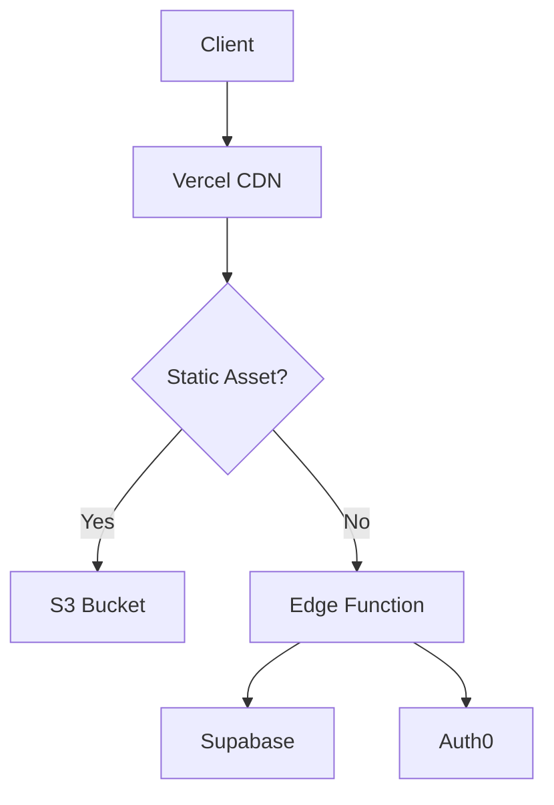

# System Architecture for AestheticPalettes

## 1. Introduction

This document details the system architecture for AestheticPalettes, as per task T024. The architecture is designed to meet the project's functional and non-functional requirements, with a strong emphasis on the zero-cost infrastructure constraint (NFR8), performance, scalability, and maintainability.

## 2. Architectural Goals

- **Zero-Cost Operation:** The primary goal is to leverage free-tier services for all aspects of the application.
- **High Performance:** Deliver a fast and responsive user experience.
- **Scalability:** Allow the system to handle growth in users and data, primarily by leveraging scalable BaaS and FaaS services.
- **Maintainability:** Ensure the codebase is modular, well-organized, and easy to update.
- **Security:** Implement security best practices at all layers.
- **Accessibility:** Design the system to support WCAG 2.1 AAA compliance.

## 3. Architectural Style: JAMstack with Serverless Functions

AestheticPalettes will adopt a **JAMstack** (JavaScript, APIs, Markup) architecture, supplemented by serverless functions for dynamic backend logic.

- **JavaScript (Client-Side):** The frontend will be a Single Page Application (SPA) built with React (or a similar modern framework like Svelte/Vue if reassessed for better performance/simplicity within zero-cost). It will handle UI rendering, user interactions, and client-side logic.
- **APIs (Server-Side):** Backend logic, database interactions, and third-party service integrations will be handled by serverless functions (e.g., Vercel Functions, Cloudflare Workers). These functions will expose GraphQL or RESTful APIs for the frontend to consume.
- **Markup (Pre-rendered):** The application shell and potentially some static content pages (like landing pages, about, etc.) can be pre-rendered at build time (Static Site Generation - SSG) or rendered on demand (Server-Side Rendering - SSR for specific routes like palette permalinks for SEO) and served via a CDN.

## JAMstack Implementation

### Core Components:

1. **Static Site Hosting**: Vercel (Next.js)
2. **Serverless Functions**: Vercel Edge Network
3. **Database**: Supabase (PostgreSQL)
4. **Auth**: Auth0 Free Tier
5. **Search**: Algolia DocSearch
6. **Analytics**: Plausible.io

### Architecture Flow:

### Key Decisions:

- Zero-downtime deployments via Vercel Instant Rollbacks
- Edge caching of color palettes using stale-while-revalidate
- JWT-based authentication flow with HttpOnly cookies

### 4.1. Frontend Application

- **Technology:** React, TypeScript, Vite, Redux Toolkit, Tailwind CSS, Headless UI.
- **Responsibilities:**
  - Rendering the user interface.
  - Managing client-side state.
  - Handling user input and interactions.
  - Making API calls to backend services.
  - Implementing color manipulation logic (potentially using WebAssembly for performance-critical tasks if needed and feasible within zero-cost).
  - Ensuring accessibility (WCAG 2.1 AAA).
- **Hosting:** Served as static assets from a CDN (Vercel/Netlify).

### 4.2. Serverless API Layer

- **Technology:** Node.js/TypeScript running on Vercel Functions or Cloudflare Workers.
- **API Style:** Primarily GraphQL to allow flexible data fetching for the client. REST endpoints for specific simple operations or webhooks if more appropriate.
- **Responsibilities:**
  - Authenticating and authorizing user requests (via Supabase Auth).
  - Validating incoming data.
  - Interacting with the Supabase database (CRUD operations for palettes, user data, etc.).
  - Executing business logic (e.g., complex palette generation algorithms if not fully client-side, processing image uploads for color extraction).
  - Integrating with any third-party services (if any).

### 4.3. Database

- **Technology:** Supabase (PostgreSQL).
- **Responsibilities:**
  - Persisting user accounts and profiles.
  - Storing user-created color palettes, collections, and tags.
  - Managing relationships between users and their palettes.
  - Potentially storing trending palettes or community data.
- **Access:** Accessed primarily through the Serverless API layer. Supabase Row Level Security (RLS) will be used extensively to enforce data access policies.

### 4.4. Authentication Service

- **Technology:** Supabase Auth.
- **Responsibilities:**
  - User registration (email/password, social logins).
  - User login and session management (JWTs).
  - Password recovery.
  - Managing user identities.

### 4.5. CDN (Content Delivery Network)

- **Technology:** Provided by Vercel/Netlify.
- **Responsibilities:**
  - Serving static frontend assets (HTML, CSS, JavaScript, images) globally with low latency.
  - Caching API responses where appropriate to reduce load on serverless functions and database.

## 5. Data Flow Examples

### 5.1. User Registers & Saves a Palette

1.  User interacts with the React frontend to create an account.
2.  Frontend calls the `/auth/signup` endpoint on the Serverless API.
3.  Serverless function interacts with Supabase Auth to create the user.
4.  User logs in, receives a JWT.
5.  User creates a palette on the frontend.
6.  Frontend calls a `/palettes` (POST) GraphQL mutation on the Serverless API, including the JWT.
7.  Serverless function validates the JWT, authorizes the user, validates palette data.
8.  Serverless function saves the palette to the Supabase PostgreSQL database, associating it with the user ID.
9.  Serverless function returns a success response to the frontend.

### 5.2. User Views a Shared Palette URL

1.  User navigates to a URL like `aestheticpalettes.com/palette/:paletteId`.
2.  If SSR is configured for this route: Vercel/Netlify invokes a serverless function to fetch palette data from Supabase based on `paletteId` and renders the initial HTML.
3.  If CSR (Client-Side Rendering): The static React app loads. The frontend extracts `paletteId` from the URL.
4.  Frontend calls a `/palettes/:paletteId` (GET) GraphQL query on the Serverless API.
5.  Serverless function fetches the palette data from Supabase.
6.  Serverless function returns palette data to the frontend.
7.  Frontend renders the palette.

## 6. Zero-Cost Considerations

- **Static Hosting:** Vercel/Netlify free tiers are generous for static assets.
- **Serverless Functions:** Free tiers for Vercel Functions/Cloudflare Workers cover a significant number of invocations and execution time.
- **Database & Auth:** Supabase free tier provides sufficient database storage, auth users, and API requests for an initial launch.
- **Optimization:** Code will be optimized to minimize function execution time, database queries, and data transfer to stay within free limits.

## 7. Scalability and Future Enhancements

- **Stateless Serverless Functions:** Can be scaled horizontally by the platform provider.
- **Supabase:** Offers paid tiers for increased database size, compute, and features.
- **CDN Caching:** Reduces load on backend services.
- Future enhancements like real-time collaboration could leverage Supabase's real-time capabilities.

This architecture provides a robust, cost-effective, and scalable foundation for AestheticPalettes.
